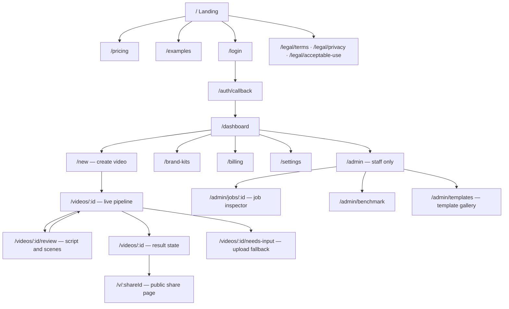
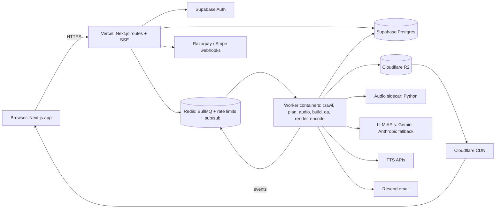
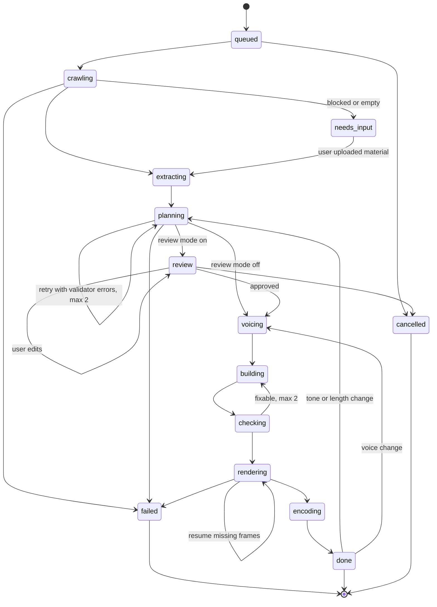
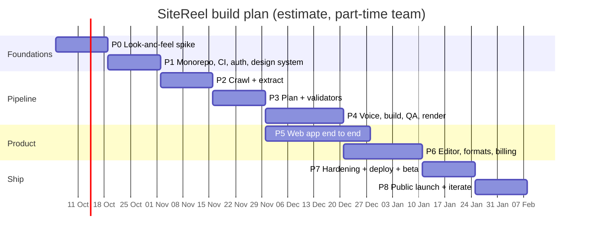
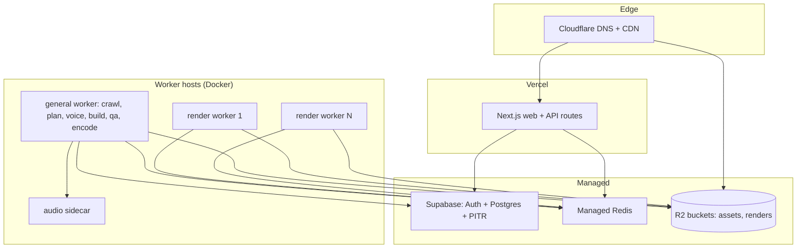
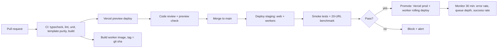

# SiteReel — Master Implementation Plan

> **Working name:** SiteReel (placeholder; rename freely)
> **What it is:** Paste a website URL → get a 15–30 s narrated, on-brand motion-graphics video in 16:9, 9:16 and 1:1.
> **Document owner:** Product Engineering · **Version:** 1.0 · **Date:** 30 Sep 2026
> **Companion doc:** `url-to-video-pipeline-plan.md` (research on 8 open-source repos + pipeline rationale). This file is the *build* plan: what to build, in what order, how, and how to ship it.

---

## How to read this document

| Part | Contents |
|---|---|
| 1 | Product scope, users, MVP boundary, success metrics |
| 2 | Tech stack, repo layout, environment setup |
| 3 | Frontend: design system (dark theme, shadcn), libraries, sitemap, **wireframes for every screen**, component inventory, motion and accessibility rules |
| 4 | Backend: data model, API, job queue, pipeline workers, film runtime, renderer |
| 5 | **Phase-wise implementation plan (Phase 0 → Phase 8)**, each with tasks, deliverables and exit criteria |
| 6 | Testing, quality and the evaluation benchmark |
| 7 | Deployment: environments, infrastructure, CI/CD, launch checklist, runbooks |
| 8 | Security, legal, cost controls, risks |
| Appendices | Env vars, ticket list, prompt skeletons, definitions of done |

Labels: **[Decision]** a choice made in this plan · **[Assumption]** something to verify · **[Estimate]** a number that needs measuring.

A note on "perfect": no plan survives contact with real URLs unchanged. This plan is designed to be *corrected cheaply*: every stage has measurable exit criteria, and Phase 0 exists specifically to find out early whether the output looks good enough to be a product.

---

# Part 1 — Product scope

## 1.1 Problem and users

Founders, indie makers, small agencies and marketers need short launch/promo videos but lack motion-design skills, budget or time. They already have a website that contains their message, brand and product screenshots.

| Persona | Need | Success for them |
|---|---|---|
| **Indie founder** | Launch video for X/LinkedIn/Product Hunt | Postable video in < 10 min without editing tools |
| **Agency / freelancer** | Quick promo videos for many client sites | Brand kits, bulk formats, no watermark |
| **SMB marketer (India focus)** | Reels in English + Hindi/regional language | Correct brand colors, local-language voice |

## 1.2 MVP scope (v1.0 public launch)

**In scope**
- URL input → crawl → script → voice → motion video
- Options: format (16:9, 9:16, 1:1), length (15/20/30 s), tone (4 presets), voice (English + Hindi at launch), music on/off
- Script review screen: edit lines and on-screen text before rendering
- Result page: player, download all formats, poster, captions (VTT), share caption
- Accounts, credits, payments, watermark on free tier
- 10 scene templates
- Admin: job inspector, benchmark dashboard

**Out of scope for v1** (backlog)
- Custom LLM-written scenes (Phase 8 experiment)
- Full timeline editor, drag-and-drop scene reordering beyond a simple list
- Avatars, generative video b-roll, 3D
- Team workspaces, API access, white-labelling

## 1.3 Success metrics

| Metric | Launch target |
|---|---|
| Job success rate (URL → MP4, no human help) | ≥ 95% on 100-URL benchmark |
| Downloaded without edits | ≥ 50% of completed jobs |
| Invented numbers/quotes on screen | 0 (hard gate) |
| p50 time to script review | < 90 s |
| p50 time to final MP4 (all formats) | < 5 min |
| AI cost per video | ≤ $0.15 [Estimate, Gemini default path] |
| Free → paid conversion | ≥ 3% in first 60 days |

---

# Part 2 — Stack and repository

## 2.1 Stack decisions

| Layer | Choice | Why |
|---|---|---|
| Monorepo | **pnpm + Turborepo** | Shared TS types/schemas between web, workers and film runtime |
| Web app | **Next.js (App Router) + React + TypeScript** | Your core stack; server components + route handlers |
| UI kit | **shadcn/ui** (Radix primitives) + **Tailwind CSS v4** | Owned components, full theming, accessible primitives |
| Animation (UI) | **Motion** (`motion`, formerly Framer Motion) | Layout animations, page transitions, gestures |
| Extra UI | Magic UI / Aceternity-style effects (copied in, shadcn-style), **sonner**, **cmdk**, **vaul**, **lucide-react**, **embla-carousel**, **react-resizable-panels**, **recharts** (via shadcn charts) | See §3.3 |
| Forms / validation | **react-hook-form + zod** | Same zod schemas used by the API |
| Client data | **TanStack Query** + **nuqs** (URL state) + **zustand** (editor state) | Server cache vs URL state vs local UI state kept separate |
| Auth | **Supabase Auth** (Google + email magic link) | You already know Supabase |
| DB | **Postgres (Supabase)** + **Drizzle ORM** | Typed schema + migrations |
| Queue | **BullMQ + Redis** | Retries, backoff, per-stage queues, rate limiting |
| Workers | **Node.js 22 + TypeScript** containers | Same language as web |
| Crawler / renderer | **Playwright (Chromium)** + **ffmpeg** | Deterministic frame capture |
| Audio tools | Small Python sidecar: **librosa** (beats), **faster-whisper** (alignment fallback), **pyloudnorm** | Mature audio ecosystem |
| Storage | **Cloudflare R2** (S3 API) | No egress fees for video delivery |
| LLM | Provider interface; **default Gemini 3.8 Flash**, fallback **Claude Sonnet 5.5** | Cost vs quality (see cost notes, §8.3) |
| TTS | Provider interface; Gemini TTS / ElevenLabs | Hindi quality must be benchmarked |
| Payments | **Razorpay** (INR, UPI) + **Stripe** (international) [Assumption: check Stripe India account eligibility] | Indian + global customers |
| Email | **Resend** + React Email | Transactional emails |
| Product analytics | **PostHog** | Funnels, feature flags, session replay |
| Errors / tracing | **Sentry** + OpenTelemetry | Frontend + workers |
| Hosting | **Vercel** (web) · **Docker VM → autoscaled containers** (workers) | §7 |

**[Decision]** Library versions: install the latest stable at project start and **pin exact versions** in `package.json`. Several libraries here change fast; do not upgrade mid-phase without a reason.

## 2.2 Repository layout

```
sitereel/
├── apps/
│   ├── web/                      # Next.js app (marketing site + dashboard + API routes)
│   │   ├── app/
│   │   │   ├── (marketing)/      # /, /pricing, /examples, /legal/*
│   │   │   ├── (auth)/           # /login, /auth/callback
│   │   │   ├── (app)/            # /dashboard, /new, /videos/[id], /brand-kits, /billing, /settings
│   │   │   ├── (admin)/          # /admin/jobs, /admin/benchmark, /admin/templates
│   │   │   └── api/              # route handlers (jobs, storyboards, webhooks, sse)
│   │   ├── components/
│   │   │   ├── ui/               # shadcn components (generated, owned)
│   │   │   ├── magic/            # animated effects (beams, grid, marquee, shimmer)
│   │   │   ├── marketing/        # hero, feature grid, example gallery
│   │   │   ├── create/           # URL input, option pickers
│   │   │   ├── pipeline/         # live stage tracker
│   │   │   ├── editor/           # script/scene editor
│   │   │   └── player/           # film preview player
│   │   ├── lib/                  # auth, api client, query keys, utils
│   │   └── styles/globals.css
│   ├── worker/                   # BullMQ workers: crawl, plan, audio, build, qa, render, encode
│   └── audio-sidecar/            # Python FastAPI: beats, alignment, loudness
├── packages/
│   ├── shared/                   # zod schemas: Storyboard, Scene, SiteBrief, FactLedger, JobOptions, events
│   ├── db/                       # Drizzle schema, migrations, queries
│   ├── film-runtime/             # __film contract, virtual clock, easing, seeded RNG, scene templates
│   ├── renderer/                 # Playwright frame capture, purity test, text probe, ffmpeg encode
│   ├── llm/                      # provider interface (Gemini, Anthropic), prompts, validators
│   ├── tts/                      # provider interface (Gemini TTS, ElevenLabs)
│   └── config/                   # eslint, tsconfig, tailwind preset
├── infra/
│   ├── docker/                   # worker.Dockerfile, sidecar.Dockerfile, compose.yml
│   ├── terraform/ (Phase 7)      # optional IaC
│   └── scripts/                  # seed, backfill, benchmark runner
├── benchmark/
│   ├── urls.json                 # 100 benchmark URLs with categories
│   └── fixtures/                 # saved crawls for offline, repeatable tests
└── .github/workflows/            # ci.yml, deploy-web.yml, deploy-worker.yml, benchmark.yml
```

**[Decision]** The `film-runtime` package is shared by the **browser preview player** and the **server renderer**. Preview and final render run identical code, so what users approve is what they get.

---

# Part 3 — Frontend

## 3.1 Design direction

**Dark-only product.** Cinematic, "editing suite at night" feel: near-black surfaces, one vivid accent, generous type, motion used to show *progress and cause/effect*, never as decoration that slows the user.

Principles:
1. **The video is the hero.** Every screen centers the preview, the scene list or the result. Chrome stays quiet.
2. **Show the machine working.** The pipeline tracker is a signature moment: live stages, thumbnails appearing as scenes are built.
3. **One accent, used for action.** Accent color means "primary action or live progress" only.
4. **Fast, then calm.** UI transitions ≤ 250 ms; nothing blocks input.

## 3.2 Dark theme tokens (shadcn + Tailwind v4)

**[Decision]** Force dark: `<html class="dark">`, no theme toggle in v1. Define the same values in `:root` and `.dark` so nothing ever renders light.

```css
/* apps/web/styles/globals.css */
@import "tailwindcss";
@import "tw-animate-css";

@custom-variant dark (&:is(.dark *));

:root, .dark {
  --radius: 0.75rem;

  --background: oklch(0.14 0.005 270);          /* near-black, cool */
  --foreground: oklch(0.96 0.005 270);
  --card: oklch(0.18 0.006 270);
  --card-foreground: var(--foreground);
  --popover: oklch(0.19 0.007 270);
  --popover-foreground: var(--foreground);

  --primary: oklch(0.72 0.19 295);              /* electric violet accent */
  --primary-foreground: oklch(0.15 0.02 295);
  --secondary: oklch(0.24 0.008 270);
  --secondary-foreground: var(--foreground);
  --muted: oklch(0.22 0.006 270);
  --muted-foreground: oklch(0.70 0.01 270);
  --accent: oklch(0.26 0.02 295);
  --accent-foreground: var(--foreground);

  --destructive: oklch(0.65 0.22 25);
  --success: oklch(0.74 0.17 155);
  --warning: oklch(0.82 0.16 80);

  --border: oklch(1 0 0 / 9%);
  --input: oklch(1 0 0 / 12%);
  --ring: oklch(0.72 0.19 295 / 60%);

  --chart-1: oklch(0.72 0.19 295);
  --chart-2: oklch(0.74 0.15 200);
  --chart-3: oklch(0.80 0.15 80);
  --chart-4: oklch(0.70 0.18 20);
  --chart-5: oklch(0.74 0.17 155);

  --sidebar: oklch(0.16 0.006 270);
  --sidebar-foreground: var(--foreground);
  --sidebar-border: var(--border);
  --sidebar-accent: var(--accent);
  --sidebar-primary: var(--primary);
}

@theme inline {
  --color-background: var(--background);
  --color-foreground: var(--foreground);
  --color-card: var(--card);
  --color-card-foreground: var(--card-foreground);
  --color-popover: var(--popover);
  --color-popover-foreground: var(--popover-foreground);
  --color-primary: var(--primary);
  --color-primary-foreground: var(--primary-foreground);
  --color-secondary: var(--secondary);
  --color-secondary-foreground: var(--secondary-foreground);
  --color-muted: var(--muted);
  --color-muted-foreground: var(--muted-foreground);
  --color-accent: var(--accent);
  --color-accent-foreground: var(--accent-foreground);
  --color-destructive: var(--destructive);
  --color-success: var(--success);
  --color-warning: var(--warning);
  --color-border: var(--border);
  --color-input: var(--input);
  --color-ring: var(--ring);
  --radius-sm: calc(var(--radius) - 4px);
  --radius-md: calc(var(--radius) - 2px);
  --radius-lg: var(--radius);
  --radius-xl: calc(var(--radius) + 4px);
  --font-sans: var(--font-geist-sans);
  --font-mono: var(--font-geist-mono);
}

body { @apply bg-background text-foreground antialiased; }
```

**Typography:** Geist Sans (UI), Geist Mono (timecodes, stage labels). Display headings use tight tracking (`tracking-tight`, `-0.03em` at ≥ 48 px).

**Elevation in dark mode:** use lighter surfaces (`card` > `background`) and 1 px low-alpha borders instead of shadows. Accent glow (`shadow-[0_0_40px_-10px_var(--primary)]`) only on the primary CTA and the live progress element.

**Contrast rule:** body text ≥ 4.5:1, large text ≥ 3:1. `muted-foreground` on `background` must be checked with a contrast tool before shipping.

## 3.3 Libraries and where each is used

| Library | Use | Screens |
|---|---|---|
| shadcn/ui | Button, Input, Card, Dialog, Sheet, Tabs, Select, RadioGroup, Slider, Switch, Badge, Tooltip, DropdownMenu, Table, Skeleton, Progress, Separator, ScrollArea, Accordion, Form, Sidebar, Breadcrumb, Chart, Carousel, Resizable, Sonner, Command, Drawer | All |
| Motion (`motion/react`) | Page transitions, `layout` animations in scene list, stage tracker, number tickers, reveal-on-scroll | Landing, pipeline, editor |
| Magic UI-style components (copied in) | Animated beam (pipeline diagram on landing), border beam on CTA card, marquee (logo/example strip), shimmer button, animated grid background, number ticker | Landing, pricing |
| sonner | Toasts ("Line re-voiced", "Render started") | All app screens |
| cmdk | ⌘K command palette: new video, jump to video, settings | App shell |
| vaul | Mobile bottom drawers (options, scene edit) | Mobile |
| react-resizable-panels | Editor layout: scene list / preview / inspector | Script review |
| embla-carousel | Example gallery | Landing |
| recharts (shadcn Chart) | Usage/credits chart, admin metrics | Billing, admin |
| lucide-react | Icons | All |
| TanStack Query | Server state, polling fallback, optimistic edits | App |
| nuqs | URL state (filters, active tab, selected scene) | Dashboard, editor |
| zustand | Editor draft state + undo stack | Script review |
| react-hook-form + zod | Create form, settings, brand kit | Forms |
| @vercel/og (or Next OG) | Share images per video | Public share page |

**[Decision]** Effects budget: landing page may use ambient effects; **app screens may not** use continuous background animation (distracting and battery-heavy). Respect `prefers-reduced-motion` everywhere.

## 3.4 Sitemap



**[Decision]** `/videos/:id` is **one route with states** (processing → review → rendering → done/failed), not separate pages. The URL stays shareable across the whole lifecycle, and state changes animate in place.

## 3.5 App shell layout

Desktop (≥ 1024 px): collapsible shadcn `Sidebar` + top bar. Mobile: top bar + bottom tab bar; sidebar becomes a `Sheet`.

```
┌──────────────────────────────────────────────────────────────────────────────┐
│ ◧ SiteReel        [⌘K Search or jump…]                 [ 42 credits ] (◉ AB) │  ← top bar h-14
├───────────────┬──────────────────────────────────────────────────────────────┤
│ + New video   │                                                              │
│               │                                                              │
│ ▣ Videos      │                    PAGE CONTENT                              │
│ ◈ Brand kits  │                    max-w-7xl, px-6, py-8                      │
│ ₹ Billing     │                                                              │
│ ⚙ Settings    │                                                              │
│               │                                                              │
│ ───────────── │                                                              │
│ Usage         │                                                              │
│ ▓▓▓▓▓░░ 42/60 │                                                              │
│ [Upgrade]     │                                                              │
├───────────────┘                                                              │
│  w-64 (collapses to w-14 icon rail)                                          │
└──────────────────────────────────────────────────────────────────────────────┘

Mobile (< 768 px)
┌────────────────────────────┐
│ ☰  SiteReel     42 cr (◉)  │
├────────────────────────────┤
│                            │
│       PAGE CONTENT         │
│       px-4                 │
│                            │
├────────────────────────────┤
│  ▣ Videos  ⊕ New  ⚙ More   │  ← bottom tab bar, safe-area padding
└────────────────────────────┘
```

## 3.6 Wireframes — every screen

### W1. Landing page `/`

```
┌──────────────────────────────────────────────────────────────────────────────┐
│ ◧ SiteReel      Examples  Pricing  FAQ                    [Log in] [Start ▸] │  sticky, blur bg
├──────────────────────────────────────────────────────────────────────────────┤
│                       ░ animated grid background ░                           │
│              ✦ New: Hindi voiceovers  →   (badge, shimmer)                   │
│                                                                              │
│               Your website, turned into a launch video.                      │  h1 text-6xl
│         Paste a link. Get a narrated motion video in minutes.                │
│                                                                              │
│      ┌──────────────────────────────────────────────┐ ┌──────────────────┐   │
│      │ 🔗  https://yourproduct.com                  │ │ Make my video ▸  │   │  primary glow
│      └──────────────────────────────────────────────┘ └──────────────────┘   │
│               No card needed · 2 free videos · watermark on free             │
│                                                                              │
│      ┌──────────────────────────────────────────────────────────────────┐    │
│      │                                                                  │    │
│      │           ▶  HERO VIDEO (auto-muted loop, poster first)          │    │  border-beam frame
│      │                                                                  │    │
│      └──────────────────────────────────────────────────────────────────┘    │
├──────────────────────────────────────────────────────────────────────────────┤
│  HOW IT WORKS  (animated beam diagram)                                       │
│   [🔗 Your URL] ═══▶ [🧠 Script] ═══▶ [🎙 Voice] ═══▶ [🎬 Motion] ═══▶ [⬇ MP4]  │
├──────────────────────────────────────────────────────────────────────────────┤
│  EXAMPLES  (carousel, before/after: site screenshot ↔ generated video)       │
│  ◀ [ site ▸ video ] [ site ▸ video ] [ site ▸ video ] ▶                      │
├──────────────────────────────────────────────────────────────────────────────┤
│  FEATURES (bento grid)                                                       │
│  ┌──────────────┬─────────┐  ┌─────────┬──────────────┐                      │
│  │ Brand-true   │ 3 formats│ │ Edit the │ Hindi + EN   │                      │
│  │ colors/fonts │ 16:9 9:16│ │ script   │ voices       │                      │
│  └──────────────┴─────────┘  └─────────┴──────────────┘                      │
├──────────────────────────────────────────────────────────────────────────────┤
│  PRICING TEASER (3 cards)  ·  FAQ (accordion)  ·  Final CTA (URL input again)│
├──────────────────────────────────────────────────────────────────────────────┤
│  Footer: product · legal · contact · social                                  │
└──────────────────────────────────────────────────────────────────────────────┘
```
- URL input works while logged out: submitting stores the URL, sends to `/login`, then resumes at `/new?url=…`.
- Hero video: `<video muted playsinline preload="metadata" poster>`; no autoplay under reduced motion.

### W2. Login `/login`

```
┌──────────────────────────────────────────────────────────────────────────────┐
│                                   ◧ SiteReel                                 │
│                  ┌─────────────────────────────────────┐                     │
│                  │   Sign in to make your video        │                     │
│                  │   [ G  Continue with Google       ] │                     │
│                  │   ──────────── or ────────────      │                     │
│                  │   Email [___________________]       │                     │
│                  │   [ Send magic link ]               │                     │
│                  │   By continuing you agree to Terms  │                     │
│                  └─────────────────────────────────────┘                     │
│           (left/right: blurred still frames from example videos)            │
└──────────────────────────────────────────────────────────────────────────────┘
```

### W3. Dashboard `/dashboard`

```
┌──────────────────────────────────────────────────────────────────────────────┐
│ Videos                                              [Filter ▾] [+ New video]│
│ ┌──────────────────────────────────────────────────────────────────────────┐ │
│ │ Tabs: All · Processing · Needs review · Done · Failed                    │ │
│ └──────────────────────────────────────────────────────────────────────────┘ │
│ ┌────────────────┐ ┌────────────────┐ ┌────────────────┐ ┌────────────────┐  │
│ │ ▶ poster 16:9  │ │ ◌ Rendering 62%│ │ ✎ Needs review │ │ ⚠ Needs input  │  │
│ │                │ │ ▓▓▓▓▓▓░░░      │ │                │ │ Site blocked   │  │
│ │ acme.io        │ │ shopkart.in    │ │ notely.app     │ │ bank.example   │  │
│ │ 20s · 3 fmts   │ │ Stage 6/9      │ │ [Review ▸]     │ │ [Upload ▸]     │  │
│ │ 2h ago   ⋯     │ │ 1m ago   ⋯     │ │ 5m ago   ⋯     │ │ 1d ago   ⋯     │  │
│ └────────────────┘ └────────────────┘ └────────────────┘ └────────────────┘  │
│                                                                              │
│ Empty state: illustration + "Paste your first URL" inline input + examples   │
└──────────────────────────────────────────────────────────────────────────────┘
```
Card hover: poster crossfades to a muted 3 s preview loop. Status badge colors: processing = primary, review = warning, done = success, failed/needs-input = destructive.

### W4. Create video `/new`

Single page, progressive sections (not a multi-step wizard: fewer clicks).

```
┌──────────────────────────────────────────────────────────────────────────────┐
│ New video                                                                    │
│ ┌──────────────────────────────────────────────────────────────────────────┐ │
│ │ 1  Website                                                               │ │
│ │ [🔗 https://notely.app                                    ] ✓ reachable   │ │
│ │ ┌─────────────┐  Notely — Notes that write themselves                    │ │
│ │ │ favicon/OG  │  notely.app · detected colors ● ● ●  fonts: Inter        │ │  live URL preview
│ │ └─────────────┘                                                          │ │
│ ├──────────────────────────────────────────────────────────────────────────┤ │
│ │ 2  Format        (●) 16:9   ( ) 9:16   ( ) 1:1   [✓] also make others     │ │  toggle group w/ aspect icons
│ │ 3  Length        [ 15s | 20s | 30s ]                                     │ │
│ │ 4  Tone          ┌Clean┐ ┌Playful┐ ┌Cinematic┐ ┌App-store┐  (preview gif) │ │  radio cards
│ │ 5  Voice         Language [English ▾]  Voice [Aria (warm) ▾] [▶ sample]  │ │
│ │                  [ ] No voiceover (music + captions)                     │ │
│ │ 6  Music         [●] On    Mood [Upbeat ▾]                               │ │
│ │ 7  Brand kit     [Auto-detect from site ▾]                               │ │
│ │ ▸ Advanced       review script before render [●]  focus page [______]    │ │  accordion
│ ├──────────────────────────────────────────────────────────────────────────┤ │
│ │ [✓] I own this site or have permission to promote it                     │ │
│ │ Cost: 1 credit (+1 per extra format)          [ Generate video ▸ ]        │ │
│ └──────────────────────────────────────────────────────────────────────────┘ │
└──────────────────────────────────────────────────────────────────────────────┘
```
- URL field debounced (600 ms) → `POST /api/url/preview` (server-side, SSRF-guarded) returns title, favicon, OG image, reachability.
- Disabled submit until consent is ticked. Credit cost updates live.

### W5. Live pipeline `/videos/:id` (processing state)

The signature screen.

```
┌──────────────────────────────────────────────────────────────────────────────┐
│ ← Videos / notely.app                                    [Cancel job]        │
├──────────────────────────────────────────────────────────────────────────────┤
│  ┌────────────────────────────┐   ┌───────────────────────────────────────┐  │
│  │ PIPELINE                   │   │ LIVE VIEW                             │  │
│  │ ✓ Reading your site   12s  │   │ ┌───────────────────────────────────┐ │  │
│  │ ✓ Understanding it     4s  │   │ │  captured section screenshots      │ │  │
│  │ ◉ Writing the script  …    │   │ │  stream in as a masonry grid       │ │  │
│  │ ○ Voicing                  │   │ │  (fade + scale in with Motion)     │ │  │
│  │ ○ Building scenes          │   │ └───────────────────────────────────┘ │  │
│  │ ○ Quality checks           │   │ Found: ● ● ● colors · Inter · logo ✓  │  │
│  │ ○ Rendering                │   │ Key facts:                            │  │
│  │ ○ Finishing                │   │  • "Notes that write themselves"      │  │
│  │                            │   │  • "Sync across 4 devices"            │  │
│  │ ▓▓▓▓▓▓▓░░░░░░░ 38%         │   │                                       │  │
│  │ ~1 min left                │   │                                       │  │
│  └────────────────────────────┘   └───────────────────────────────────────┘  │
│  You can leave — we'll email you when it's ready.  [🔔 Notify me]            │
└──────────────────────────────────────────────────────────────────────────────┘
```
- Stage list driven by SSE events; each stage row animates `○ → ◉ (pulsing) → ✓` with duration.
- Live view changes per stage: screenshots (crawl) → fact chips (extract) → script lines typing in (plan) → waveform bars per line (voice) → scene thumbnails (build) → frame counter (render).
- Failure: stage shows `✕` with a human message and one action ("Upload screenshots instead", "Retry").

### W6. Script review `/videos/:id/review`

Three resizable panels (desktop); tabs on mobile.

```
┌──────────────────────────────────────────────────────────────────────────────┐
│ ← notely.app · Review script            20.4s ●●●  [Regenerate ▾] [Approve & render ▸]│
├──────────────┬──────────────────────────────────────────┬───────────────────┤
│ SCENES       │  PREVIEW                                 │ INSPECTOR         │
│ ┌──────────┐ │ ┌──────────────────────────────────────┐ │ Scene 2 · Features│
│ │1 Hook 3.1s│ │ │                                      │ │ Template          │
│ │ "Notes…" │ │ │     live film-runtime preview        │ │ [FeatureTriplet ▾]│
│ └──────────┘ │ │     (same code as final render)      │ │                   │
│ ┌──────────┐ │ │                                      │ │ Narration         │
│ │2 Feat 5.2s│◀│ └──────────────────────────────────────┘ │ ┌───────────────┐ │
│ │ ● active │ │  ▶ ❚❚  00:04.20 / 00:20.40   🔊 ─●──     │ │"Capture, sort │ │
│ └──────────┘ │ ┌──────────────────────────────────────┐ │ │ and search…"  │ │
│ ┌──────────┐ │ │ timeline: [1][ 2 ][ 3 ][  4  ][5]    │ │ └───────────────┘ │
│ │3 Flow 6.0s│ │ │ waveform ▁▃▅▇▅▃▁▂▅▇▆▃ music ────────  │ │ 42/140 chars      │
│ └──────────┘ │ └──────────────────────────────────────┘ │ [▶ Re-voice line] │
│ ┌──────────┐ │                                          │ On-screen text    │
│ │4 Proof   │ │  ⚠ 1 issue: Scene 3 text holds 0.9s,     │ [Capture]  ✓ fact │
│ └──────────┘ │    needs 1.2s to read  [Fix automatically]│ [Sort]     ✓ fact │
│ ┌──────────┐ │                                          │ [Search]   ✓ fact │
│ │5 CTA 2.6s│ │                                          │ Source: /features │
│ └──────────┘ │                                          │ Transition [Wipe▾]│
│ [+ Add scene]│                                          │                   │
├──────────────┴──────────────────────────────────────────┴───────────────────┤
│ Share caption: "Notely writes your notes for you…"   [Edit]                  │
└──────────────────────────────────────────────────────────────────────────────┘
```
- Every on-screen text chip shows a **✓ fact** badge (grounded) or **⚠ unverified** (user-typed claims are allowed but flagged; they're the user's responsibility).
- Edits are debounced, validated server-side (same zod + validators) and saved as a new storyboard version. Undo/redo via zustand history.
- "Approve & render" is disabled while any hard validation error exists.
- Mobile: tabs `Scenes | Preview | Edit`, scene edit in a `vaul` drawer.

### W7. Result `/videos/:id` (done state)

```
┌──────────────────────────────────────────────────────────────────────────────┐
│ ← Videos / notely.app                         [Edit script] [Duplicate] [⋯]  │
├──────────────────────────────────────────────────────────────────────────────┤
│ ┌──────────────────────────────────────────────────┐ ┌─────────────────────┐ │
│ │                                                  │ │ Formats             │ │
│ │               ▶  FINAL VIDEO PLAYER              │ │ (●) 16:9  1920×1080 │ │
│ │                                                  │ │ ( ) 9:16  1080×1920 │ │
│ │                                                  │ │ ( ) 1:1   1080×1080 │ │
│ └──────────────────────────────────────────────────┘ │                     │ │
│   00:20 · 30fps · 8.4 MB · captions ✓                │ [⬇ Download MP4]    │ │
│                                                      │ [⬇ All formats .zip]│ │
│ ┌────────────── Share caption ─────────────────────┐ │ [⬇ Poster] [⬇ .vtt] │ │
│ │ Notely writes your notes for you. Try it free →  │ │                     │ │
│ │                                    [Copy]        │ │ Share link          │ │
│ └──────────────────────────────────────────────────┘ │ [🔗 Copy public link]│ │
│                                                      │ [X] [in] [WhatsApp] │ │
│ Quick changes:  [Change voice] [Change tone] [Shorter]│                     │ │
│ Free plan: watermark on · [Remove watermark ▸]       └─────────────────────┘ │
└──────────────────────────────────────────────────────────────────────────────┘
```
Confetti-free: a subtle success animation on the player frame (border beam once), then calm.

### W8. Needs input `/videos/:id/needs-input`

```
┌──────────────────────────────────────────────────────────────────────────────┐
│ We couldn't read notely.app automatically                                   │
│ The site blocked our browser (common with bot protection). Give us these     │
│ and we'll continue:                                                          │
│ ┌──────────────────────────────────────────────────────────────────────────┐ │
│ │  ⇪ Drop 2–6 screenshots of your site (hero, features, product)           │ │  dropzone
│ └──────────────────────────────────────────────────────────────────────────┘ │
│ Describe your product in 2–3 sentences  [__________________________________] │
│ Key features (one per line)             [__________________________________] │
│ Brand color [■ #7C5CFF]  Logo [upload]                                        │
│                                                     [Continue ▸]            │
└──────────────────────────────────────────────────────────────────────────────┘
```

### W9. Public share page `/v/:shareId`

Minimal: video player, product name, caption, "Made with SiteReel — make yours" CTA (free tier). OG image + `og:video` tags for rich previews.

### W10. Brand kits `/brand-kits`

```
┌──────────────────────────────────────────────────────────────────────────────┐
│ Brand kits                                                   [+ New kit]    │
│ ┌──────────────────────────────────────────┐                                │
│ │ Notely (auto from notely.app)       ⋯    │  Colors  ■ bg ■ text ■ accent  │
│ │ Logo [svg]  Fonts: Inter / Inter         │  Logo    [replace]             │
│ │ Voice: Aria · Music: Upbeat              │  Fonts   [Display ▾][Body ▾]   │
│ └──────────────────────────────────────────┘  Default voice / music / tone  │
└──────────────────────────────────────────────────────────────────────────────┘
```

### W11. Billing `/billing`

Plan card (current plan, renewal), credits balance with usage chart (shadcn Chart, 30 days), plan comparison table, invoices table, "Buy credit pack" (Razorpay/Stripe checkout by region).

### W12. Settings `/settings`

Tabs: Profile · Notifications (email when video ready) · Defaults (format, voice, tone) · Danger zone (delete account → confirm dialog typing email).

### W13. Admin `/admin/jobs/:id` (staff only)

```
┌──────────────────────────────────────────────────────────────────────────────┐
│ Job 7f3a… · notely.app · user AB · done · $0.087 AI · 4m12s                  │
├──────────────────────────────────────────────────────────────────────────────┤
│ Stage runs (table): stage | attempt | status | duration | cost | output keys │
│ Crawl: screenshots grid · extracted brand JSON · fact ledger                 │
│ Storyboard versions: v1 (LLM) · v2 (user edit)  [diff]                       │
│ QA report: purity ✓ · text ✓ · contrast ✓ · vision review 4/5 (notes)       │
│ Contact sheet image                                                          │
│ Actions: [Re-run from stage ▾] [Download artifacts] [Mark as benchmark case] │
└──────────────────────────────────────────────────────────────────────────────┘
```
`/admin/benchmark`: table of benchmark runs (success %, fallbacks, grounding violations, avg rating, cost), trend chart, per-URL drill-down.

## 3.7 Key UI component specs

| Component | Built from | Behavior |
|---|---|---|
| `UrlInput` | shadcn `Input` + `Button` | Normalizes URL, debounced preview, inline error states: invalid / unreachable / blocked domain |
| `OptionCardGroup` | `RadioGroup` + `Card` | Keyboard arrows, aspect-ratio icon per option |
| `VoicePicker` | `Select` + audio `Button` | Plays 3 s sample; one sample playing at a time |
| `StageTracker` | custom + Motion `layout` | Consumes SSE; reconnects with `Last-Event-ID`; falls back to polling every 3 s |
| `FilmPlayer` | `<canvas>`/iframe + `film-runtime` | Play/pause/scrub; audio element synced to `t`; frame-accurate seek; keyboard `space`, `←/→` = 1 frame, `shift+←/→` = 1 s |
| `SceneList` | `ScrollArea` + Motion `Reorder` | Select scene; reorder (Phase 6); duration pill |
| `SceneInspector` | `Form` + `Textarea` + `Badge` | Char counters, fact badges, re-voice button with loading state |
| `ValidationBanner` | `Alert` | Lists hard errors (block approve) and warnings; "Fix automatically" where possible |
| `CreditMeter` | `Progress` + `Tooltip` | Shows balance; links to billing |
| `CommandMenu` | `Command` in `Dialog` | ⌘K / Ctrl+K |

## 3.8 States every screen must handle

Loading (skeletons shaped like the content), empty, error (message + recovery action), partial (some formats done), offline (toast + retry), permission denied, and reduced motion. **Definition of done for any screen includes all of these.**

## 3.9 Motion rules

| Use | Duration | Easing |
|---|---|---|
| Hover/press feedback | 120–150 ms | ease-out |
| Panels, dialogs, drawers | 200–250 ms | `[0.2, 0.8, 0.2, 1]` |
| Stage transitions, list layout | 250–350 ms | spring (stiffness 300, damping 30) |
| Landing reveals | 400–600 ms | ease-out, once per element |

Never animate layout-shifting properties on scroll in app screens. Under `prefers-reduced-motion`: disable ambient effects, replace motion with opacity fades ≤ 150 ms, no autoplay video.

## 3.10 Accessibility

WCAG 2.1 AA: focus rings visible (`ring` token), all Radix primitives keyboard-accessible, player controls labelled, live pipeline uses `aria-live="polite"` for stage changes, captions on all generated videos, color never the only status signal (icons + text).

---

# Part 4 — Backend

## 4.1 System overview



## 4.2 Data model (Drizzle, abridged)

```ts
// packages/db/schema.ts
export const users = pgTable("users", {
  id: uuid("id").primaryKey(),                 // = Supabase auth user id
  email: text("email").notNull().unique(),
  name: text("name"),
  plan: text("plan", { enum: ["free", "creator", "pro"] }).notNull().default("free"),
  credits: integer("credits").notNull().default(2),
  role: text("role", { enum: ["user", "admin"] }).notNull().default("user"),
  createdAt: timestamp("created_at").defaultNow().notNull(),
});

export const brandKits = pgTable("brand_kits", {
  id: uuid("id").primaryKey().defaultRandom(),
  userId: uuid("user_id").references(() => users.id).notNull(),
  name: text("name").notNull(),
  domain: text("domain"),
  tokens: jsonb("tokens").$type<BrandTokens>().notNull(),   // colors, fonts, logoKey
  defaults: jsonb("defaults").$type<KitDefaults>(),         // voice, music, tone
});

export const jobs = pgTable("jobs", {
  id: uuid("id").primaryKey().defaultRandom(),
  userId: uuid("user_id").references(() => users.id).notNull(),
  url: text("url").notNull(),
  domain: text("domain").notNull(),
  status: text("status").notNull(),             // see state machine §4.4
  options: jsonb("options").$type<JobOptions>().notNull(),
  currentStoryboardId: uuid("current_storyboard_id"),
  shareId: text("share_id").unique(),
  creditsCharged: integer("credits_charged").notNull().default(0),
  errorCode: text("error_code"),
  createdAt: timestamp("created_at").defaultNow().notNull(),
  updatedAt: timestamp("updated_at").defaultNow().notNull(),
}, (t) => [index("jobs_user_created_idx").on(t.userId, t.createdAt)]);

export const stageRuns = pgTable("stage_runs", {
  id: uuid("id").primaryKey().defaultRandom(),
  jobId: uuid("job_id").references(() => jobs.id).notNull(),
  stage: text("stage").notNull(),               // crawl | extract | plan | voice | build | qa | render | encode
  attempt: integer("attempt").notNull(),
  inputsHash: text("inputs_hash").notNull(),
  status: text("status").notNull(),             // running | ok | failed | skipped
  outputs: jsonb("outputs"),                    // R2 keys + summaries
  costUsd: numeric("cost_usd", { precision: 10, scale: 5 }).default("0"),
  error: jsonb("error"),
  startedAt: timestamp("started_at").notNull(),
  endedAt: timestamp("ended_at"),
}, (t) => [uniqueIndex("stage_idem").on(t.jobId, t.stage, t.inputsHash, t.attempt)]);

export const crawls = pgTable("crawls", { /* id, jobId, pagesKey, brand jsonb, facts jsonb (FactLedger), assets jsonb */ });
export const storyboards = pgTable("storyboards", { /* id, jobId, version, json (Storyboard), validation jsonb, source: llm|user|fallback */ });
export const audioTakes = pgTable("audio_takes", { /* storyboardId, sceneId, lineIdx, textHash, voice, provider, key, durationMs, words jsonb */ });
export const renders = pgTable("renders", { /* storyboardId, format, key, posterKey, vttKey, frames, durationMs, bytes, qa jsonb */ });
export const creditLedger = pgTable("credit_ledger", { /* userId, delta, reason, jobId?, paymentId?, createdAt */ });
export const payments = pgTable("payments", { /* userId, provider, providerId, amount, currency, status, raw jsonb */ });
```

**[Decision]** Credits are a **ledger** (append-only rows), and `users.credits` is a cached sum updated in the same transaction. Refund automatically when a job fails for system reasons.

Row-level security: enable Supabase RLS on every user table (`user_id = auth.uid()`), even though the server uses a service role for workers.

## 4.3 API routes

| Method | Route | Auth | Purpose |
|---|---|---|---|
| POST | `/api/url/preview` | user | SSRF-safe fetch of title/favicon/OG; reachability |
| POST | `/api/jobs` | user | Create job (idempotency key header); reserves credits |
| GET | `/api/jobs` | user | List (cursor pagination, status filter) |
| GET | `/api/jobs/:id` | owner | Job + current storyboard + renders |
| GET | `/api/jobs/:id/events` | owner | **SSE** stream (stage, progress, payload) |
| POST | `/api/jobs/:id/cancel` | owner | Cancel; refund unused credits |
| PATCH | `/api/jobs/:id/storyboard` | owner | Save edited storyboard → returns validation report + new version |
| POST | `/api/jobs/:id/revoice` | owner | Re-voice specific lines |
| POST | `/api/jobs/:id/approve` | owner | Continue to build/render |
| POST | `/api/jobs/:id/rerender` | owner | `{ change: "voice"\|"tone"\|"length"\|"format" }` |
| POST | `/api/jobs/:id/needs-input` | owner | Upload screenshots + description (signed upload URLs) |
| POST | `/api/uploads/sign` | user | Presigned R2 PUT (size + type limited) |
| GET | `/api/renders/:id/download` | owner | Short-lived signed URL |
| GET | `/api/share/:shareId` | public | Public video metadata |
| POST | `/api/billing/checkout` | user | Razorpay order / Stripe session |
| POST | `/api/webhooks/razorpay` · `/stripe` | signature | Payment events → credit ledger |
| * | `/api/admin/*` | admin | Inspector, re-run stage, benchmark |

All request/response bodies are zod schemas in `packages/shared`, used on both client and server.

**SSE on Vercel [Assumption]:** long-lived functions have duration limits. Design: SSE endpoint subscribes to Redis pub/sub for up to ~60 s, then closes; the client reconnects with `Last-Event-ID`, and the server replays missed events from a Redis stream (`XRANGE`). Polling `GET /api/jobs/:id` every 3 s is the fallback.

## 4.4 Job state machine



## 4.5 Queues and workers

| Queue | Concurrency / worker | Timeout | Retries | Notes |
|---|---|---|---|---|
| `crawl` | 2 | 90 s | 2 (backoff 10 s) | Playwright; egress-restricted network |
| `plan` | 10 | 120 s | 2 | LLM calls; per-provider rate limiter |
| `voice` | 10 | 120 s | 3 | TTS per line; cache by `hash(text, voice, provider)` |
| `build` | 4 | 60 s | 1 | Resolve template props, asset prep |
| `qa` | 2 | 120 s | 1 | Chromium probes + vision review |
| `render` | 1 per container (CPU-bound) | 15 min | resume | Chunked frame ranges, parallel containers |
| `encode` | 2 | 5 min | 2 | ffmpeg concat, mux, poster, variants |

**Orchestration:** a `FlowProducer` (BullMQ flows) or a small orchestrator that advances the state machine on `completed` events. Every worker:
1. Computes `inputsHash`; if a successful `stage_run` with that hash exists, **skip** (idempotent re-runs).
2. Writes outputs to R2 under `jobs/{jobId}/{stage}/{inputsHash}/…`.
3. Emits progress events `{ jobId, stage, pct, payload }` to Redis stream `job:{id}:events`.

## 4.6 Pipeline stage implementation notes

(Rationale for each is in the companion research doc.)

**Crawl** — Playwright at target viewport, `deviceScaleFactor: 2`; wait for load + `document.fonts.ready` + capped network idle; click consent buttons; scroll by viewport with pauses; per-section screenshots; up to 4 extra same-origin pages (pricing, features, about, docs); 60 s budget. **SSRF guard** before any fetch: resolve DNS, reject private/loopback/link-local/metadata ranges, re-check each redirect, pin resolved IP.

**Extract** — computed styles → brand tokens (bg, text, accent, button colors; fonts actually loaded; logo from header SVG/img, `link[rel=icon]`, `og:image`). Build the **FactLedger** (text, kind, source URL, selector). One cheap LLM call (Gemini Flash-Lite) → SiteBrief referencing fact ids.

**Plan** — LLM (Gemini 3.8 Flash default; Sonnet 5.5 escalation) with JSON schema output → Storyboard. Code validators: schema, fact ids exist, numbers match ledger verbatim, reading floor 0.3 s/word, template requirements (StatCounter needs a number fact), ≤ 8 words on screen at once. Two retries with validator messages; then deterministic fallback storyboard.

**Voice** — TTS per narration line; store duration + word timings (provider timestamps or faster-whisper alignment in sidecar). Scene durations computed from audio. Music from licensed library with precomputed beat grid; duck to 0.12–0.15 under voice; SFX at `marks`; loudness normalize (~ −14 LUFS, TP ≤ −1 dBTP).

**Build** — resolve each scene template's props (text, assets, palette, fonts, timings, beat locks) into a `FilmManifest` JSON consumed by `film-runtime`.

**QA** — hard gates: page loads + ready, purity hash test, visible text per scene at settle time, safe-area overflow, contrast, grounding. Soft: mid-transition double-exposure heuristic, vision-LLM contact-sheet review (max 1 rebuild).

**Render** — split frames into ranges across containers; each captures `seek(i/fps)` as PNG, pipes into ffmpeg per segment; atomic writes; resume missing ranges.

**Encode** — concat segments, mux audio (AAC 192k, `-shortest`), BT.709 tags, `+faststart`; poster = settled frame from `marks`, baked into frame 0; watermark overlay for free tier; VTT captions from word timings.

## 4.7 Film runtime (shared by preview and renderer)

```ts
// packages/film-runtime/src/contract.ts
export interface FilmManifest {
  width: number; height: number; fps: 30; duration: number;
  palette: { bg: string; fg: string; accent: string };
  fonts: { display: string; body: string };
  scenes: ResolvedScene[];                 // template id + props + start/end
  captions: { t0: number; t1: number; text: string }[];
  audioUrl?: string;                       // preview only; renderer muxes separately
}

export interface SceneTemplate<P> {
  id: string;
  mount(root: HTMLElement, props: P, ctx: FilmContext): void;   // build DOM once
  seek(localT: number): void;                                   // pure in localT
  marks(props: P): { t: number; type: string }[];
}

declare global {
  interface Window {
    __film: { ready: boolean; duration: number; fps: number; seek(t: number): void; marks: { t: number; type: string }[] };
  }
}
```

Rules enforced by lint + QA: no `Math.random` (use `rng(seedKey)`), no `Date.now`/`performance.now` in scene code, no CSS transitions, GSAP timelines only created `paused` and driven by `tl.seek(localT)`, all images decoded and fonts loaded before `ready = true`.

**Virtual clock** (injected by the renderer via `addInitScript`, re-implemented in-house): overrides `performance.now`, `Date`, `requestAnimationFrame`, timers; on seek, pauses all `document.getAnimations()` and sets `currentTime`. Protects against any template that accidentally uses CSS animations or rAF.

**Renderer core loop (sketch):**

```ts
// packages/renderer/src/renderRange.ts
export async function renderRange(opts: {
  manifestUrl: string; from: number; to: number; fps: number; outSegment: string;
}) {
  const browser = await chromium.launch({ args: ["--no-sandbox", "--font-render-hinting=none", "--force-color-profile=srgb"] });
  const ctx = await browser.newContext({ viewport: { width: W, height: H }, deviceScaleFactor: 1 });
  await ctx.addInitScript(VIRTUAL_CLOCK);
  const page = await ctx.newPage();
  await page.goto(`${FILM_HOST}/film.html?manifest=${encodeURIComponent(opts.manifestUrl)}&capture=1`);
  await page.waitForFunction(() => window.__film?.ready === true, null, { timeout: 30_000 });

  const ff = spawnFfmpegSegment(opts.outSegment, opts.fps);          // image2pipe png → libx264 bt709
  for (let i = opts.from; i <= opts.to; i++) {
    await page.evaluate((t) => window.__film.seek(t), i / opts.fps);
    const png = await page.screenshot({ type: "png" });
    if (!ff.stdin.write(png)) await once(ff.stdin, "drain");
  }
  ff.stdin.end();
  await ffDone(ff);
  await browser.close();
}
```

**Purity test (sketch):** at 9 times, hash the frame at `t`, hash again, seek elsewhere, seek back, hash again; all three must match.

---

# Part 5 — Phase-wise implementation plan

## 5.0 Timeline overview

**[Assumption]** Team of 1–2 developers working part-time (~20–25 h/week each). Full-time roughly halves the calendar. Treat week numbers as planning estimates, not commitments.



Phase 5 (frontend) runs in parallel with Phase 4 once the storyboard schema is frozen at the end of Phase 3.

---

## Phase 0 — Look-and-feel spike (≈ 2 weeks)

**Goal:** prove the videos can look good *before* building any infrastructure. This is the single biggest product risk.

Tasks
- [ ] Pick 3 real sites (one SaaS, one e-commerce, one Indian SMB).
- [ ] Hand-write `FilmManifest` JSON for each (no LLM).
- [ ] Build `film-runtime` skeleton: contract, easing helpers, seeded RNG, text fitting utility.
- [ ] Build 4 templates: `KineticHook`, `FeatureTriplet`, `SectionShowcase`, `CTAEndCard`.
- [ ] `film.html` page that plays a manifest in the browser (scrub bar).
- [ ] Minimal renderer script: single process, virtual clock, PNG → ffmpeg, add a music track by hand.
- [ ] Purity test script.

Deliverables: 3 MP4s, `packages/film-runtime` v0, `packages/renderer` v0.

**Exit criteria**
- You (and 3 people outside the team) would post at least 2 of the 3 videos.
- Purity test passes on all 3.
- 20 s 1080p video renders in < 2 min on one machine [Estimate].
- **If exit criteria fail, iterate on templates before Phase 1.** Do not build infrastructure around weak output.

## Phase 1 — Foundations (≈ 2 weeks)

Tasks
- [ ] Monorepo: pnpm, Turborepo, shared tsconfig/eslint/prettier, `packages/shared` zod schemas.
- [ ] Next.js app with App Router; shadcn init; Tailwind v4; dark tokens (§3.2); Geist fonts; `next/font`.
- [ ] Install core shadcn components (§3.3) and create `components/magic/*` effects.
- [ ] App shell: sidebar, top bar, mobile tab bar, ⌘K command menu, sonner toaster.
- [ ] Supabase project: auth (Google + magic link), `/login`, `/auth/callback`, middleware protecting `(app)` routes.
- [ ] Drizzle schema + migrations for `users`, `jobs`, `stage_runs`, `credit_ledger`; RLS policies.
- [ ] Redis (managed) + BullMQ skeleton worker app with a `hello` queue.
- [ ] R2 bucket + presigned upload/download helpers.
- [ ] Sentry (web + worker), PostHog (web), structured logging (pino) with `jobId` on every line.
- [ ] GitHub Actions CI: install, typecheck, lint, unit tests, build (§7.4).
- [ ] Vercel project with preview deploys per PR.

**Exit criteria:** a logged-in user sees the dashboard shell on a Vercel preview URL; CI green; a test job travels API → queue → worker → DB → SSE → UI.

## Phase 2 — Crawl and extract (≈ 2 weeks)

Tasks
- [ ] `ssrfSafeFetch` + DNS pinning + redirect checks; unit tests with private-IP fixtures.
- [ ] Crawl worker (Playwright): consent-click heuristics, scroll pass, section screenshots, same-origin page discovery, budgets.
- [ ] Fallback: plain fetch → `needs_input`.
- [ ] Brand extraction from computed styles; logo discovery; font detection with Google Fonts mapping.
- [ ] FactLedger builder (headings, hero copy, feature lists, stats, testimonials, CTAs) with source selectors.
- [ ] SiteBrief LLM call (Flash-Lite) + zod validation.
- [ ] `/api/url/preview` endpoint.
- [ ] Benchmark v0: 30 URLs in `benchmark/urls.json`; script saves crawls as fixtures.

**Exit criteria:** ≥ 90% of 30 benchmark URLs produce a non-empty FactLedger with ≥ 3 features and correct primary colors (manual spot check); blocked sites land in `needs_input`, never in a generic video.

## Phase 3 — Plan and validators (≈ 2 weeks)

Tasks
- [ ] Freeze **Storyboard v1 schema** in `packages/shared` (this unblocks Phase 5).
- [ ] `packages/llm`: provider interface, Gemini + Anthropic adapters, JSON-schema output, token + cost accounting per call, timeouts, retries.
- [ ] Planner prompt (Appendix C) with template catalog and rubric.
- [ ] Validators: schema, fact ids, number grounding, reading floor, template requirements, word limits.
- [ ] Retry-with-errors loop, escalation to Sonnet after 2 failures, deterministic fallback storyboard.
- [ ] Offline eval: run planner over saved fixtures; store storyboards; human-rate 20 of them.

**Exit criteria:** 100% of fixture runs end with a *valid* storyboard (LLM or fallback); 0 ungrounded numbers; median plan latency < 20 s [Estimate]; LLM cost per plan logged.

## Phase 4 — Voice, build, QA, render at scale (≈ 3 weeks)

Tasks
- [ ] `packages/tts`: provider interface; per-line synthesis; caching; word timings (provider or sidecar alignment).
- [ ] Audio sidecar (FastAPI): `/beats`, `/align`, `/loudness`, `/mix`.
- [ ] Music library ingest: licensed tracks + precomputed beat grids.
- [ ] Timing engine: scene durations from audio; beat locks; transition overlaps.
- [ ] Complete template set to 10: add `LogoReveal`, `HeroRebuild`, `UIFlowCursor`, `StatCounter`, `QuoteCard`, `ChecklistReveal` (9:16 and 1:1 layouts for each).
- [ ] QA worker: purity, text probe, overflow/safe-area, contrast, grounding re-check, contact sheet, vision review.
- [ ] Distributed render: split ranges, parallel containers, resume, segment concat, mux.
- [ ] Encode worker: poster frame-0 bake, watermark, VTT captions, three formats.
- [ ] End-to-end CLI: `pnpm pipeline run <url>` for local testing.

**Exit criteria:** ≥ 90% success on 50-URL benchmark end-to-end; p50 total < 5 min; per-video AI cost measured and ≤ target; QA catches seeded defects (planted overflow, planted `Math.random`) 100% of the time.

## Phase 5 — Web app end to end (≈ 4 weeks, parallel with Phase 4)

Tasks
- [ ] Landing page (W1) with hero video, animated beam "how it works", example carousel, bento features, pricing teaser, FAQ.
- [ ] Create page (W4) with live URL preview, option cards, voice samples, consent, credit cost.
- [ ] Live pipeline screen (W5): SSE client with reconnect/replay, stage tracker, per-stage live view.
- [ ] Result screen (W7): player, format switch, downloads, share link, caption copy.
- [ ] Needs-input screen (W8) with R2 direct upload.
- [ ] Dashboard (W3) with tabs, cards, hover previews, empty state.
- [ ] Public share page (W9) with OG/video meta.
- [ ] Email: "Your video is ready", "We need your help" (React Email + Resend).
- [ ] All screens: loading/empty/error/reduced-motion states (§3.8).
- [ ] Playwright e2e: signup → create → (mock pipeline) → result.

**Exit criteria:** a new user can go from landing page to downloaded MP4 on staging without help; Lighthouse ≥ 90 performance and accessibility on landing (mobile).

## Phase 6 — Editor, formats, brand kits, billing (≈ 3 weeks)

Tasks
- [ ] Script review screen (W6): resizable panels, live preview via `film-runtime`, scene inspector, fact badges, validation banner, undo/redo, re-voice line.
- [ ] Storyboard versioning + downstream-only re-runs.
- [ ] Quick changes on result page: voice / tone / length.
- [ ] Brand kits (W10): auto-create from crawl, edit, apply to new jobs.
- [ ] Billing (W11): plans, credit packs, Razorpay + Stripe checkout, webhooks → credit ledger, invoices, refunds on system failure.
- [ ] Free-tier watermark + limits; paid removes watermark.
- [ ] Settings (W12), account deletion (GDPR-style data deletion job).
- [ ] Admin: job inspector (W13), re-run from stage, benchmark dashboard.

**Exit criteria:** edit → re-voice → approve → render works with only affected stages re-running; test payments in sandbox credit accounts correctly (including webhook retries and duplicates); admin can diagnose any failed job from the inspector alone.

## Phase 7 — Hardening, production deployment, closed beta (≈ 2 weeks)

Tasks
- [ ] Production infrastructure (§7): prod Supabase, prod Redis, R2 prod bucket + CDN domain, worker hosts, secrets.
- [ ] Rate limits (per user, per IP, per domain), abuse checks, maximum concurrent jobs per user.
- [ ] Load test: 50 concurrent jobs; tune render concurrency and autoscaling.
- [ ] Chaos tests: kill a render container mid-job (resume works), LLM provider down (fallback works), TTS down (captions-only works).
- [ ] Security review (§8.1 checklist); dependency audit; secrets scan.
- [ ] Legal pages: Terms, Privacy, Acceptable Use, takedown contact. [Get them reviewed.]
- [ ] Backups: Postgres PITR enabled; R2 lifecycle rules.
- [ ] Runbooks (§7.7), on-call alerting (Sentry + uptime).
- [ ] Closed beta: 20–50 users; collect ratings in-app (thumbs + reason) and 5 interviews.

**Exit criteria:** ≥ 95% success on 100-URL benchmark; zero Sev-1 bugs open; beta users rate ≥ 3.5/5 average; restore-from-backup drill done once.

## Phase 8 — Public launch and iteration (≈ 2 weeks, then ongoing)

Tasks
- [ ] Launch assets: videos of our own site made by the product, Product Hunt page, X/LinkedIn posts, demo on the landing page.
- [ ] Monitoring war-room for launch week: queue depth, failure rate, cost per video, conversion funnel.
- [ ] Weekly benchmark regression run in CI; template improvements from vision-review issue categories.
- [ ] Backlog experiments (feature-flagged via PostHog): custom LLM scene, more Indian languages, team workspaces, API.

**Exit criteria:** launch-week success rate ≥ 95% on real traffic; cost per video within 20% of estimate; first paying customers.

---

# Part 6 — Testing and quality

## 6.1 Test pyramid

| Level | Tooling | What |
|---|---|---|
| Unit | Vitest | Validators, SSRF guard, timing engine, credit ledger math, zod schemas |
| Template tests | Vitest + Playwright | Each template renders sample props at 5 times; purity test; snapshot hash per template (visual regression) |
| Integration | Vitest + Testcontainers (Postgres, Redis) | Queue flows, idempotent stage skipping, resume |
| E2E | Playwright | Signup → create → review → result, with a mocked pipeline and one nightly real pipeline run |
| Pipeline eval | `benchmark/` runner | 100 URLs; success, fallbacks, grounding, cost, human ratings |

## 6.2 Evaluation benchmark

- 100 URLs across categories: SaaS, e-commerce, portfolio, agency, Indian SMB, JS-heavy SPA, bot-protected, one-pager, non-English.
- Crawls saved as fixtures → planner/templates can be evaluated offline and repeatably.
- Nightly: 20-URL sample live; weekly: full 100 (using Batch APIs where available to halve LLM cost).
- Report stored in DB and shown on `/admin/benchmark`.
- Any PR touching `packages/llm`, `packages/film-runtime` templates or prompts must attach a benchmark diff.

## 6.3 Definition of done (every ticket)

Typed (no `any` in shared code), tested at the right level, loading/empty/error states handled, accessible (keyboard + labels), logged with `jobId`/`userId`, feature-flagged if risky, docs updated if it changes a contract.

---

# Part 7 — Deployment

## 7.1 Environments

| Env | Web | Workers | Data | Purpose |
|---|---|---|---|---|
| Local | `next dev` | `docker compose up` (Redis, worker, sidecar) | Supabase local (CLI), MinIO for R2 | Development |
| Preview | Vercel preview per PR | Shared staging workers | Staging DB/Redis/R2 | Review UI changes |
| Staging | Vercel `staging` branch | 1 worker VM | Staging project | Pre-prod, benchmark runs |
| Production | Vercel `main` | Worker hosts (below) | Prod project, PITR on | Customers |

## 7.2 Production topology



**Worker hosting path [Decision]:**
1. **Beta:** 1–2 VMs (e.g., 8 vCPU / 16 GB) running Docker Compose: `general` worker ×1, `render` worker ×N (N ≈ vCPUs / 2), sidecar ×1. Simple, cheap, easy to debug.
2. **Growth:** move render workers to an autoscaling container platform (AWS ECS on Fargate/EC2 with queue-depth scaling, or Fly.io Machines, or GKE). Scale on BullMQ `render` queue waiting count. Your AWS certification makes ECS a natural choice.

**Crawler network isolation:** run crawl workers in a separate container network with egress allowed only to the public internet (block RFC1918/metadata at the firewall/security-group level), no access to Redis/DB except through a narrow job API or a dedicated low-privilege Redis user.

## 7.3 Worker Dockerfile (sketch)

```dockerfile
FROM mcr.microsoft.com/playwright:v1-noble   # pin exact tag at setup
RUN apt-get update && apt-get install -y --no-install-recommends ffmpeg fonts-noto fonts-noto-color-emoji \
    && rm -rf /var/lib/apt/lists/*
WORKDIR /app
COPY pnpm-lock.yaml package.json pnpm-workspace.yaml ./
COPY packages ./packages
COPY apps/worker ./apps/worker
RUN corepack enable && pnpm install --frozen-lockfile --filter worker... && pnpm --filter worker build
ENV NODE_ENV=production
USER pwuser
CMD ["node", "apps/worker/dist/index.js"]
```

Fonts: pre-install Noto families plus a curated set of Google Fonts at build time, and load brand fonts from the Google Fonts CSS API at render time with a local cache, so renders don't depend on network flakiness mid-job.

## 7.4 CI/CD



Rules:
- DB migrations run in a separate job **before** code deploy, and must be backward-compatible (expand → migrate → contract).
- Worker deploys are rolling: new workers start, old ones stop taking jobs (`worker.close()` waits for in-flight jobs; render jobs are resumable anyway).
- Feature flags (PostHog) for risky features; kill-switch flags for LLM provider and TTS provider selection.

## 7.5 Configuration and secrets

Secrets live in Vercel env (web) and the worker host's secret manager (AWS SSM/Secrets Manager, or Doppler/1Password for the beta VMs). Never in the repo. See Appendix A for the full list.

## 7.6 Launch checklist

- [ ] Custom domain, HTTPS, HSTS, security headers (CSP, frame-ancestors, referrer policy)
- [ ] Rate limits and per-user concurrency caps active
- [ ] Payment webhooks verified in live mode; refund path tested
- [ ] Backups (PITR) enabled and restore tested
- [ ] Alerts: success rate < 90% (15 min), queue wait > 5 min, error spike, cost per video > 2× baseline, webhook failures
- [ ] Status page
- [ ] Legal pages live; takedown email monitored
- [ ] Music licenses on file
- [ ] Privacy: data retention jobs scheduled (crawl artifacts 30 days)
- [ ] Load test report attached
- [ ] Runbooks reviewed

## 7.7 Runbooks (outline)

| Incident | First checks | Mitigation |
|---|---|---|
| Success rate drop | Admin benchmark + stage failure breakdown | If crawl: check blocked-site rate; if plan: switch provider flag; if render: scale / roll back image |
| LLM provider outage | Provider status, error codes | Flip `LLM_PROVIDER` flag to fallback |
| Queue backlog | Render queue waiting count | Scale render workers; temporarily lower max format count for free tier |
| Cost spike | Cost per stage dashboard | Check retry loops; cap retries; switch model tier |
| Abuse (impersonation report) | Job + user lookup | Disable share link, delete renders, suspend user, reply to reporter |

---

# Part 8 — Security, legal, cost, risks

## 8.1 Security checklist

- SSRF protection on every server-side fetch (URL preview, crawl, asset download).
- Crawler and renderer sandboxed; no credentials beyond scoped storage writes.
- Presigned uploads: size limit, content-type allowlist, virus scan for user uploads (ClamAV or provider) [Decision: Phase 7].
- Webhook signature verification; idempotent payment processing.
- RLS on all user tables; admin routes check role server-side.
- CSP on the app; film pages render only our own template code in v1.
- Rate limits: per user, per IP, per target domain.
- Secrets scanning in CI (gitleaks); dependency audit (`pnpm audit`, Dependabot).

## 8.2 Legal and trust

- Consent checkbox + Terms forbidding use on sites you don't have rights to promote.
- Watermark on free tier; takedown process with a named contact.
- Music/SFX: only tracks with written commercial SaaS rights.
- Voice: provider stock voices only; no cloning.
- Reused open-source code: only MIT/Apache-licensed sources, with attribution (see research doc; shipvideo, PDoomVideo and SuhaasNv code must not be copied).
- Have Terms/Privacy reviewed by a lawyer before public launch. (This plan is not legal advice.)

## 8.3 Cost controls

- Default model: Gemini 3.8 Flash for planning (promo price through 31 Dec 2026, **doubles from 1 Jan 2027**), Flash-Lite for extraction; escalate to Sonnet 5.5 only on repeated validation failure. [Estimate: ~$0.09–0.15 AI per video on this path.]
- Per-call token/cost logging into `stage_runs.cost_usd`; daily cost dashboard; alert on anomalies.
- Caches: crawl (URL + day), TTS (text + voice), beat grids (track).
- Render previews at 540p/15 fps; full render only after approval.
- Hard caps: max 2 LLM retries, max 1 vision-review rebuild, max render duration.

## 8.4 Top risks

| Risk | Likelihood | Impact | Mitigation |
|---|---|---|---|
| Output not good enough vs competitors | High | Fatal | Phase 0 gate; template investment; benchmark ratings |
| Many sites block crawling | Medium | High | `needs_input` path that feels good; mobile pass |
| Cheap LLM gives dull storyboards | Medium | Medium | Benchmark models; escalation routing |
| Hindi TTS quality weak | Medium | Medium | Benchmark providers before launch claims |
| Render cost/time at scale | Medium | Medium | Chunked parallel render; preview-first |
| Impersonation / misuse | Medium | High | Consent, watermark, takedown, domain verification (backlog) |
| Solo-dev bandwidth | High | High | Strict MVP scope; cut Phase 6 extras before cutting quality |

---

# Appendices

## Appendix A — Environment variables

```bash
# Web (Vercel)
NEXT_PUBLIC_SUPABASE_URL=
NEXT_PUBLIC_SUPABASE_ANON_KEY=
SUPABASE_SERVICE_ROLE_KEY=
DATABASE_URL=
REDIS_URL=
R2_ACCOUNT_ID=
R2_ACCESS_KEY_ID=
R2_SECRET_ACCESS_KEY=
R2_BUCKET_ASSETS=
R2_BUCKET_RENDERS=
NEXT_PUBLIC_CDN_BASE=
RAZORPAY_KEY_ID=
RAZORPAY_KEY_SECRET=
RAZORPAY_WEBHOOK_SECRET=
STRIPE_SECRET_KEY=
STRIPE_WEBHOOK_SECRET=
RESEND_API_KEY=
NEXT_PUBLIC_POSTHOG_KEY=
SENTRY_DSN=

# Workers
DATABASE_URL=
REDIS_URL=
R2_* (same as above)
LLM_PROVIDER=gemini            # gemini | anthropic
LLM_ESCALATION_PROVIDER=anthropic
GEMINI_API_KEY=
ANTHROPIC_API_KEY=
TTS_PROVIDER=gemini            # gemini | elevenlabs
ELEVENLABS_API_KEY=
AUDIO_SIDECAR_URL=http://sidecar:8000
FILM_HOST=http://localhost:4100   # static server for film.html inside worker
RENDER_CONCURRENCY=1
SENTRY_DSN=
```

## Appendix B — Ticket list by phase (starter backlog)

| ID | Phase | Ticket |
|---|---|---|
| P0-1 | 0 | film-runtime contract + helpers |
| P0-2 | 0 | Templates: KineticHook, FeatureTriplet, SectionShowcase, CTAEndCard |
| P0-3 | 0 | Single-process renderer + purity test |
| P1-1 | 1 | Monorepo + CI |
| P1-2 | 1 | shadcn + dark tokens + app shell + ⌘K |
| P1-3 | 1 | Supabase auth + protected routes |
| P1-4 | 1 | Drizzle schema v1 + RLS |
| P1-5 | 1 | BullMQ + SSE event pipe |
| P2-1 | 2 | SSRF-safe fetch |
| P2-2 | 2 | Playwright crawl worker |
| P2-3 | 2 | Brand + FactLedger extraction |
| P2-4 | 2 | SiteBrief LLM call |
| P3-1 | 3 | Storyboard schema freeze |
| P3-2 | 3 | LLM provider package + cost accounting |
| P3-3 | 3 | Planner prompt + validators + fallback |
| P4-1 | 4 | TTS package + per-line voice + alignment |
| P4-2 | 4 | Audio sidecar (beats, mix, loudness) |
| P4-3 | 4 | Remaining 6 templates × 3 formats |
| P4-4 | 4 | QA worker |
| P4-5 | 4 | Distributed render + encode |
| P5-1 | 5 | Landing page |
| P5-2 | 5 | Create page |
| P5-3 | 5 | Live pipeline screen |
| P5-4 | 5 | Result + share pages |
| P5-5 | 5 | Dashboard |
| P6-1 | 6 | Script review editor |
| P6-2 | 6 | Versioning + partial re-runs |
| P6-3 | 6 | Brand kits |
| P6-4 | 6 | Billing (Razorpay + Stripe) + credits ledger |
| P6-5 | 6 | Admin inspector + benchmark dashboard |
| P7-1 | 7 | Prod infra + secrets |
| P7-2 | 7 | Load + chaos tests |
| P7-3 | 7 | Security + legal review |
| P7-4 | 7 | Closed beta |
| P8-1 | 8 | Launch |

## Appendix C — Planner prompt skeleton

```text
SYSTEM
You are a motion-video director for short product launch videos. You write a storyboard as JSON that
matches the provided schema exactly. You never invent facts: every claim on screen or in narration must
cite fact ids from the FACT LEDGER. You may invent framing, hooks and transitions.

RULES
- Total length: {targetSec}s. Shape: hook (2–3s) → reveal (2–4s) → 2–3 highlights → CTA (2–4s).
- Max 8 words on screen at once. Reading floor: 0.3s per word after text settles.
- One idea per scene. Model the viewer: list what they must understand, one read at a time.
- Prefer showing the product in use (UIFlowCursor, SectionShowcase) over describing it.
- Use only these templates: {templateCatalogWithRequirements}.
- Banned phrases: "streamline your workflow", "supercharge", "unlock", "elevate".
- Tone: {tone}. Language: {language}.

INPUT
SITE BRIEF: {siteBrief}
FACT LEDGER: {facts}
ASSETS: {assetList with ids and descriptions}
BRAND: {brandTokens}

OUTPUT
First fill "rubric" (what, who, differentiator, strongest grounded claim, visual hook, user flow, caption),
then "scenes". JSON only.
```

On validation failure, the retry message is the validator report verbatim plus: "Fix only these problems; keep everything else."

## Appendix D — Glossary

| Term | Meaning |
|---|---|
| FactLedger | List of claims found on the site with source URL + selector |
| Storyboard | Validated JSON plan of scenes, narration, on-screen text |
| FilmManifest | Resolved storyboard with timings, assets and props, consumed by film-runtime |
| Purity | Property that `seek(t)` always produces identical pixels for the same `t` |
| Settle time | Moment in a scene when its text is fully visible and not yet exiting |
| Needs input | Job state asking the user for screenshots/description when crawling fails |
