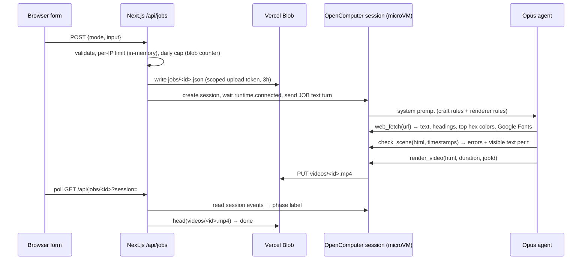
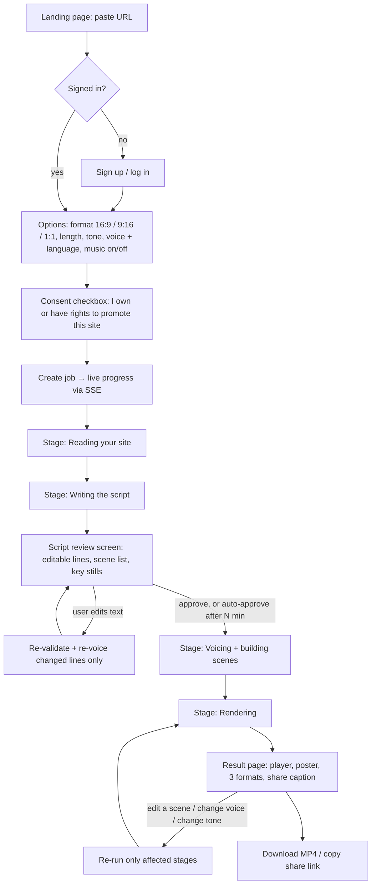
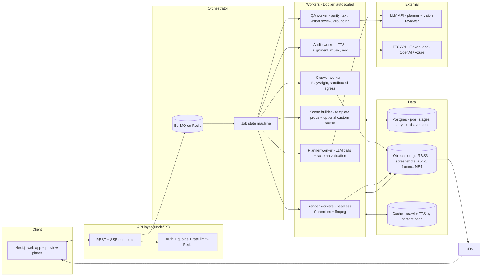
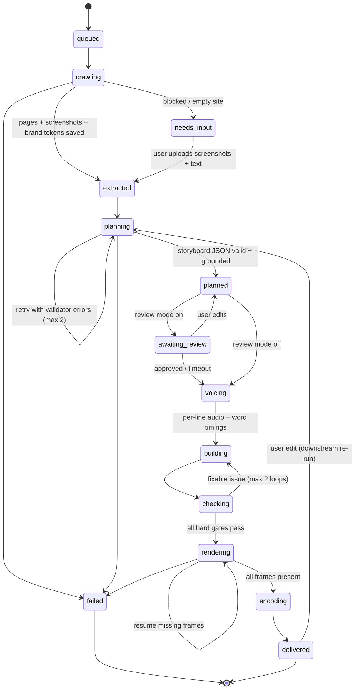
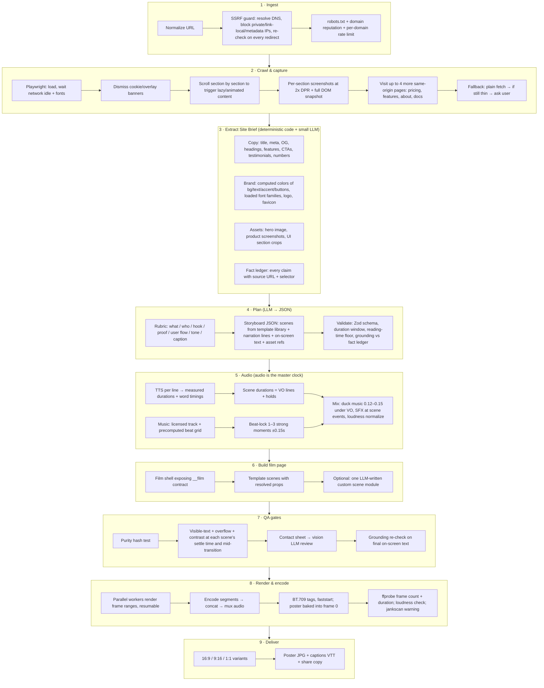

# URL → Motion Video: Research Findings and Generation Pipeline Plan

**Author role:** Senior engineer + PM review · **Date:** 30 Sep 2026 · **Status:** Draft v1 for build planning

This document has three parts:

1. **Research** — how eight open-source projects in this space actually build their pipelines, read from their source code (not only their READMEs), with what each does well and badly.
2. **Corrections** — places where the guide you shared (`opus_motion_video_guide.md`) or my earlier answer were wrong or incomplete.
3. **The plan** — the architecture, website flow, pipeline stages, contracts, reliability gates, infrastructure and build roadmap for our product.

Labels used throughout: **[Fact]** = verified in source code or official docs; **[Inference]** = my reading of the evidence; **[Opinion]** = a judgment call you can disagree with; **[Unverified]** = plausible but not checked.

---

## 0. Executive summary

- **[Fact]** Every project studied uses the same core mechanism: a model writes HTML/CSS/JS (or fills a template), a headless Chromium draws each frame at an exact time `t` under a controlled clock, and ffmpeg encodes the frames. None use a video diffusion model.
- **[Fact]** The projects split into two families:
  - **Family A — "the model writes the whole film"** (shipvideo, /brag-slim, opus-js-animations, PDoomVideo). Highest creative ceiling. Quality and failure rate vary run to run, and every job costs a long agent loop on a top model.
  - **Family B — "the model writes a structured script; code renders it"** (agentic-motion-graphics' `script.json`, /brag's plan → brief split, HyperFrames compositions). More predictable and cheaper, but only as good as its templates.
- **[Opinion]** For a *product* that must work for strangers' URLs every time, pick **Family B as the default path with a Family A escape hatch**: the LLM outputs a validated JSON storyboard that picks from our scene-template library, and may optionally write *one* custom scene under a strict contract. If that custom scene fails automatic checks, it gets swapped for a template scene instead of failing the job.
- **[Fact]** The strongest reliability techniques found, all of which this plan adopts:
  - `seek(t)` purity contract + automatic purity test (opus-js `verify.mjs`)
  - virtual clock injected into the page so CSS/WAAPI/rAF/timers all obey `t` (shipvideo `renderer.ts`)
  - visible-text check at timestamps before rendering (shipvideo `check_scene`)
  - contact sheets + mid-transition stills reviewed before full render (opus-js, /brag-slim)
  - claim grounding — every product claim must exist on the source site (/brag step 3)
  - reading-time floor of ~0.3 s per word (/brag)
  - audio as master clock — per-line TTS durations set scene lengths (opus-js `voiceover.py`, /brag)
  - resumable, atomic, parallel frame rendering (PDoomVideo `render.mjs`)
  - BT.709-tagged encodes, no animated grain, poster baked into frame 0 (opus-js delivery, /brag step 4)
- **[Fact]** Licensing is a real constraint: the most product-like repo (**shipvideo**) has **no license file**, so we must not copy its code; we can re-implement its *ideas*.

---

## Part 1 — Research: how each project builds its pipeline

### 1.1 Comparison at a glance

| Repo | Input | Who writes the video | Renderer | Audio | QA gates | License | Relevance to us |
|---|---|---|---|---|---|---|---|
| **latent-spaces/brag** (`/brag`) | Project source code | Model writes plan + brief; HyperFrames builds composition | HyperFrames CLI | Bundled music + 150+ CC0 SFX, beat cues, optional Kokoro TTS | `hyperframes check` (layout, WCAG contrast), grounding checklist, poster pick | MIT (music license flagged unverified by its own README) | **Very high** — closest creative spec for launch videos |
| **brag** (`/brag-slim`) | Project dir **or a website URL** | Model builds everything itself | Model's own headless-browser script | Model-generated | Stills of every scene + mid-transitions | MIT | **High** — its URL-crawl rules are directly applicable |
| **diggerhq/shipvideo** (LaunchVideo) | URL or prompt | Opus writes one HTML file | Playwright + injected virtual clock + ffmpeg, per-job microVM | **None** | `check_scene` (JS errors, failed requests, visible text at timestamps) | **No license** | **Very high** — only one that is a deployed URL→video web product |
| **klsoen/opus-js-animations** | Idea / audio | Model directs + writes one canvas page | Raw CDP (no npm deps), parallel workers, supersampling | File, yt-dlp link, Web Audio synth, ElevenLabs/OpenAI TTS, Whisper align | `verify.mjs` purity, contact sheets, crops, human treatment approval | MIT | **High** — best QA and delivery engineering |
| **JohnHeibel/PDoomVideo** | Song + lyrics | Opus + parallel subagents via `ANIMATION_GUIDE.md` | Puppeteer, resumable parallel JPEG frames | Given song | Contact sheets | No LICENSE file (`package.json` says ISC) | Medium — shows multi-agent scene building |
| **JohnHeibel/ClaudeAnimationBase** | Prompt | Model following a rules guide | Same as PDoom, cleaned up | Optional song | Sheets, strips, world-tracking crops | MIT | Medium — its "timing for the viewer" rules are excellent |
| **SuhaasNv/claude-opus5.5-video** | — (showcase) | Model | Playwright, SwiftShader WebGL, 8-sample motion blur, raw RGBA pipe | numpy synth, hit-locked to visual events | Stills | No license file | Low–medium — polish techniques, too heavy for us |
| **siyuanfeng636-cpu/agentic-motion-graphics** | URL, article, brief | Model writes `script.json` → GSAP page | HyperFrames | OpenAI/ElevenLabs TTS, Whisper words, synth SFX | lint, snapshot, ffprobe/LUFS | MIT | **High** — the only one with a **JSON script schema** |
| **stas4000/jankscan** | Rendered MP4 | — | — | — | Held/jump/freeze frame detection | MIT | Medium — advisory QA only (see §2) |

Last commit on every repo is 24–30 Sep 2026: this whole ecosystem is days to weeks old. **[Inference]** Expect breaking changes; pin versions.

### 1.2 latent-spaces/brag — the best *creative* spec

**Pipeline (from `skills/brag/SKILL.md` + 4 step references):**

```
Inspect code ─► 9-question rubric ─► brag-plan.md (storyboard) ─► composition-brief.md ─► HyperFrames builds ─► hyperframes check ─► render ─► poster ─► share copy
```

What it does well **[Fact]**:
- **Separation of concerns.** /brag owns *what* (angle, copy, tone, moments, audio intent). HyperFrames owns *how* (DOM, timing, animation mechanics). The brief is the explicit boundary. This is the same split our planner/renderer should have.
- **9-question rubric before planning:** what is it, most impressive claim, visual hook, which UI to show, shortest satisfying length, tone, audio feel, share caption, and the **user flow worth showing** (entry → key action → result). The rule is that the product *in use* beats the landing page *describing* it.
- **Creative laws:** 15–25 s (18–22 sweet spot); hook in first 2 s; shape Hook (2–3 s) → Reveal (2–4 s) → 2–3 highlights → Outro (2–4 s); "show the thing"; generic SaaS language banned.
- **Reading-time floor:** short label ≈0.8 s settled; sentences ≈0.3 s/word, minimum ≈1.2 s. Fast-in, then hold. Sequential *text* must not snap to every beat above ~110 BPM (they found beats ~0.5 s apart outran reading).
- **Grounding rule:** names, numbers, capabilities, quotes must appear in the source; framing and jokes may be invented. `hyperframes check` can't catch invented claims, so it's an explicit manual pass.
- **Audio craft:** precomputed beat grids + `strongCues` per bundled track (`analyze_music_cues.py`, librosa: onset strength + RMS + bass band); lock only 1–3 major moments to strong cues within ±0.15 s, sequential items to beats within ±0.10 s; music ducks to 0.12–0.15 under voiceover; SFX chosen *after* animation exists so sound matches motion.
- **Delivery detail:** pick a *settled* poster frame, then overlay it onto frame 0 with ffmpeg (`overlay=enable='eq(n,0)'`) because Slack/X/Discord thumbnail from frame 0 and ignore cover metadata.
- **Secret hygiene:** never read `.env`, keys, customer names into anything that could appear on screen.

Weaknesses **[Inference]**:
- Designed as a coding-agent skill, not a service: it relies on an agent loop with a strong model per run.
- Input is a *local codebase*; only /brag-slim handles URLs, and only in prose instructions.
- Its bundled music license is "verify before redistributing" per its own README — not usable in a commercial product as-is.

### 1.3 /brag-slim — URL crawling rules worth copying

`skills/brag-slim/SKILL.md` accepts `http(s)://` URLs and says **[Fact]**:
- A plain download of a JS-built site can return an empty shell → load it in a **headless browser**.
- **Dismiss cookie banners/overlays**, and **scroll section by section**, because scroll-triggered content stays blank in one full-page capture.
- Extract copy (headline, tagline, headings, features, CTAs, testimonials, title, meta and social tags), exact colors from CSS, loaded fonts, logo, product screenshots, demo videos.
- Prefer re-using the site's real markup/CSS/assets over panning across flat screenshots.
- Check stills from every scene **and from mid-transition**; a plain crossfade between two busy layouts makes "muddy double exposure" — stagger out/in or dip through background.

### 1.4 diggerhq/shipvideo (live as LaunchVideo) — the only deployed URL→video product

**Architecture [Fact, from `web/src` and `opencomputer/agents/director`]:**



Strong ideas **[Fact]**:
- **Virtual clock** injected via `addInitScript`: overrides `performance.now`, `Date`, `requestAnimationFrame`, `setTimeout/setInterval`, and on every `__seek(t)` pauses all `document.getAnimations()` and sets `currentTime`. This makes CSS keyframes, WAAPI, rAF loops and timers all deterministic — the model doesn't need to write a special `seek()` API.
- **Guardrails in the tool, not just the prompt:** rejects `<video>`, `<audio>`, `<iframe>`; prompt forbids CSS transitions, `Math.random`, external images.
- **`check_scene`** walks visible text nodes (opacity ≥ 0.05, on-screen rect) at chosen timestamps. It cheaply catches "leftover words from the previous beat" and "empty beat".
- **Scoped, short-lived upload token** so the sandbox never holds the main storage key; the token is fetched by the tool from a manifest because "models mangle" long tokens.
- **Per-job isolated microVM** — crawling arbitrary URLs happens in a disposable sandbox.
- Phase labels for UX are derived from tool events (`web_fetch` → "Reading the page", etc.).

Weaknesses **[Fact → Inference]**:
- `web_fetch` is a plain `fetch` + regex HTML stripping: **JS-rendered sites return near-empty text**, colors are "most frequent hex strings in HTML", which misses CSS files, `rgb()`/`oklch()` and CSS variables.
- **No audio at all.**
- **No SSRF defence** in `web_fetch` beyond an http(s) check; safety comes only from the microVM isolation.
- Rate limiting is an in-memory map per function instance and a racy blob counter (their own comments call it "a soft ceiling").
- The upload-token manifest is **public** JSON; safety relies on the 8-char job id being unguessable.
- One monolithic HTML generation per job: if the model's film is weak, there is no structured way to fix one scene.
- ~1 min cold bootstrap per session (installs Chromium + ffmpeg); render ≈ real time (30 s film → 30–40 s).
- **No license** → can't reuse code.

### 1.5 klsoen/opus-js-animations — best QA and delivery engineering

Pipeline: brief → sound source → audio analysis → direction questions → **treatment approved by human** → build from template → verify → render → deliver.

Reusable engineering **[Fact, from `scripts/*.mjs` and `references/`]**:
- **Contract:** `window.__film = { duration, ready, seek(t), shots, marks }`. Tools poll `__film.ready` instead of sleeping.
- **`verify.mjs` purity test:** at 9 times, hash `seek(t)` twice, jump elsewhere, jump back, hash again. All three must match. This one test catches `Math.random`, frame counters and mutated state — the main cause of flicker and "stills don't match render".
- **`stills.mjs`:** contact sheets, frame-by-frame strips around a transition, and 1:1 crops — cheap, targeted visual review.
- **`render.mjs`:** N parallel Chrome workers each render a frame range to a segment; segments concatenated with absolute paths (relative concat paths are a listed pitfall); audio muxed with `-shortest`; final `ffprobe` frame/packet count.
- **Delivery science (`delivery.md`)** — measured by the author:
  - Lossless PNG capture, convert to **yuv420p BT.709 limited range and tag it**; untagged/BT.601 files shift colors after platform re-encode.
  - **No animated grain** in uploads: on their test, SSIM after simulated Instagram re-encode was ~.94 without grain vs ~.85 with animated grain.
  - `--ss 2` supersampling improved PSNR from 39.1 to 45.0 dB at ~2× render time.
  - 30 fps, not 60, for social: same bitrate, twice the bits per frame.
- **Voiceover (`voiceover.py`):** voices **one line at a time** so phrase boundaries are exact, a single line can be re-voiced, and scene timing uses *measured* durations. ElevenLabs returns character alignment → word times; OpenAI returns none → run Whisper alignment.
- **Scale guide:** under ~30 s = one continuous scene; minutes = multi-agent "production" with a bible, shared kits, a proven cold-open scene as quality bar, and a continuity pass. Parallel agents cause **continuity drift**; anything seen in two scenes must be a shared module.

### 1.6 PDoomVideo and ClaudeAnimationBase — timing and multi-agent lessons

- **[Fact]** PDoom's `render.mjs --frames` is **resumable and atomic**: it skips frames already on disk (size > 1 KB), writes `f.tmp` then renames, and uses a shared work queue across worker pages.
- **[Fact]** Shot registry: `chapter(name, start, end, shots)`; each shot `fn(t, lt, dur)` paints the whole frame and must be pure in `t`.
- **[Fact]** ClaudeAnimationBase's `ANIMATION_GUIDE.md` rule 4, "Timing: model the viewer": list the *reads* per shot, one read at a time, fast actions but held meanings, lead the eye, let reads set shot length. It states timing is "the rule models get wrong most often." This belongs in our planner prompt.
- **[Fact]** It also records that without a GPU, p5.brush watercolor fills take seconds per frame — heavy effects must be budgeted.

### 1.7 SuhaasNv/claude-opus5.5-video — polish ceiling

8 sub-frames per output frame (real motion blur), lens pass, 120 BPM cut grid, numpy score with a sound at each visual event's timestamp. **[Inference]** Impressive but ~8× render cost; out of scope for an MVP. Worth borrowing: *drive picture and sound from one event list*.

### 1.8 siyuanfeng636-cpu/agentic-motion-graphics — the only JSON script schema

- **[Fact]** `templates/script_schema.json`: `{title, archetype, targetDuration, bpm, aspectRatio, scenes:[{id, sceneName, narration, onScreenText[], visualIdea, sfxCue}]}` with a `product-launch` archetype that "crawls website assets".
- **[Fact]** Pipeline: research → `script.json` → TTS (trim silence, `atempo≈1.05`) → Whisper word timings → GSAP page bound to `timing.json` → synthesized SFX on the BPM grid → `hyperframes lint/snapshot/render` → `ffprobe` checks (resolution, −14 LUFS, black frames).
- **[Inference]** Weakness: TTS the whole script, *then* transcribe it back with Whisper to recover timings. Per-line TTS (opus-js) or provider timestamps are cheaper and more exact. `visualIdea` is free text, so the renderer still depends on the model improvising.

### 1.9 stas4000/jankscan — useful, but not a hard gate

- **[Fact]** Decodes to 64×36 grayscale, compares each frame change to the local median; flags *held*, *jump*, *freeze*.
- **[Fact, from its own benchmark]** Found a planted repeated frame in 72% of cases and a planted dropped frame in 47%; **25 of 40 untouched videos were flagged** too (some real, some legitimate jumps like counters/cuts).
- **[Opinion]** With a frame-exact `seek(t)` renderer, dropped frames are structurally unlikely. Use jankscan as a **logged warning**, not a job-failing gate.

### 1.10 HyperFrames (used by /brag and agentic-motion-graphics)

- **[Fact]** HeyGen's HTML→MP4 framework; reported as Apache-2.0, deterministic frame-by-frame capture in headless Chromium, compositions use `data-*` timing attributes + CSS + GSAP ([noqta.tn overview](https://www.noqta.tn/en/blog/heygen-hyperframes-html-to-mp4-ai-agent-video-2026)).
- **[Fact]** /brag relies on `hyperframes check` for layout overflow and WCAG contrast (errors, not warnings), `snapshot`, `preview`, `render --quality draft|high`, `tts` (Kokoro), `beats`.
- **[Unverified]** API stability and server-side throughput at scale; it was built for local agent use.

---

## Part 2 — Corrections to the shared guide and to my earlier answer

| Claim | Status | Evidence |
|---|---|---|
| Guide: PDoomVideo is "MIT-adjacent" | **Wrong/unclear** | No LICENSE file; only `"license": "ISC"` in `package.json`. Treat as all-rights-reserved until clarified. |
| Guide: shipvideo is a reusable productized tool | **Partly right** | Deployable template, but **no license file**, so its code can't legally be copied into our product. It's now branded LaunchVideo. |
| Guide: shipvideo "renders frame by frame … uploads" | Right, but **incomplete** | It produces **silent** video. There is no audio path. |
| Guide: jankscan is "worth running on anything before you post it" | **Overstated** | Its own benchmark: 47–72% recall and 25/40 clean videos flagged. Advisory only. |
| Guide: agentic-motion-graphics uses Whisper for word timestamps | Right | But it transcribes TTS output back through Whisper, which is avoidable. |
| Guide: "no diffusion model" in all of these | **Right** | Confirmed in every repo. |
| Guide: "What's new in Opus 5.5 is holding a whole film in its head" | **[Unverified]** | Anecdotal from repo authors; not measured. Don't build a product on it alone. |
| **My earlier answer: use Remotion** | **Revised** | Remotion requires a Company License for orgs with more than 3 people; SaaS rendering falls under "Automators" at $0.01/render with a $100/month minimum ([Remotion license FAQ](https://www.remotion.dev/docs/license/faq)). That is affordable, but the research shows a **thin in-house seek(t) renderer** (~300 lines) or Apache-2.0 HyperFrames gives the same determinism without license dependency, and lets the LLM write plain HTML scenes. Decision in §4.4. |
| My earlier answer: "don't let the model design freely" | **Refined** | Still true for the default path, but the research shows model-written scenes can be excellent *when gated*. The plan below allows one gated custom scene. |

Not verified by me: the guide's DistilBook pricing and timing figures, and any claims about specific viral videos. They don't affect the architecture.

---

## Part 3 — The plan

### 3.1 Product definition (PM view)

**One-liner:** Paste your website link; get a 15–30 s narrated, on-brand motion video of your product, ready for Reels/Shorts/LinkedIn/X.

**Target users [Opinion]:** founders, indie makers, small agencies, SaaS marketers. Possible differentiator for us: Indian SMBs and regional-language voiceover (Hindi, Marathi, Tamil…), which none of the studied repos target.

**Non-goals for v1:** long-form (>60 s), talking avatars, generative-video b-roll, 3D, arbitrary user-supplied HTML.

**Success metrics:**

| Metric | v1 target [Opinion] |
|---|---|
| Job success rate (URL in → MP4 out, no human help) | ≥ 95% on a fixed benchmark of 100 URLs |
| "Usable without edits" rate (user downloads without editing) | ≥ 50% |
| Ungrounded-claim rate (manual audit) | 0 invented numbers/quotes |
| p50 time to first preview (storyboard + stills) | < 90 s |
| p50 time to final MP4 | < 5 min |
| Cost per video | measure in Phase 1; set price ≥ 3× cost |

### 3.2 How the website works (user flow)



Why a script-review screen: **[Fact]** opus-js blocks on human treatment approval and DistilBook locks narration after approval; **[Inference]** editing text before render is far cheaper than re-rendering. It's optional so the "one-click" path still works.

### 3.3 System architecture



Principles **[Opinion, backed by the research]**:
1. **Every stage is a pure function of its inputs, and its outputs are persisted.** A failure at render never re-crawls or re-prompts. An edit re-runs only downstream stages.
2. **The LLM never touches infrastructure.** It returns JSON (and optionally one HTML scene module). Workers do the crawling, uploading and rendering. This removes shipvideo's "model copies the upload token" class of bugs.
3. **Deterministic rendering.** Same storyboard + same assets = byte-identical frames.
4. **Every stage has a fallback that still produces a video.**

### 3.4 Job state machine



Each transition writes a `stage_runs` row with inputs hash, outputs (S3 keys), duration, cost, error. Retries are idempotent by `(job_id, stage, inputs_hash)`.

### 3.5 End-to-end pipeline



The detailed spec for each stage follows.

### 3.6 Stage specs

#### Stage 1 — Ingest & safety

- Accept `http(s)` only; normalize (add scheme, strip fragments, punycode).
- **SSRF guard (must-have):** resolve DNS yourself; reject RFC1918, loopback, link-local (`169.254.0.0/16` incl. cloud metadata), IPv6 ULA, `0.0.0.0`; **re-check after every redirect**; pin the resolved IP for the connection to prevent DNS rebinding. Crawler runs in a network namespace/VPC with **no route to internal services**. (shipvideo relied only on microVM isolation.)
- Per-user quotas and per-IP limits in **Redis** (not in-memory like shipvideo).
- Consent: user asserts they own or may promote the site. Optional v2: DNS TXT / meta-tag domain verification for "verified brand" badge and higher limits.

#### Stage 2 — Crawl & capture

- Playwright Chromium, viewport = target format (1920×1080 for 16:9; also a 390×844 mobile pass for 9:16 layouts), `deviceScaleFactor: 2`.
- Wait for `load`, `document.fonts.ready`, network idle (with a cap), then:
  - click common consent buttons ("Accept", "Agree", "Got it", `[id*=cookie] button`) — best effort;
  - scroll by viewport height with pauses so `IntersectionObserver` animations fire (/brag-slim);
  - screenshot each `<section>`/landmark block separately + the hero at exact target aspect.
- Save: final HTML, `document.documentElement.outerHTML` after scripts, computed-style samples, screenshots, discovered assets (logo via `link[rel=icon]`, `og:image`, header `img/svg`).
- Crawl budget: home + up to 4 same-origin pages ranked by link text (pricing, features, product, about, docs). Hard limits: 60 s total, 20 MB assets.
- **Fallback ladder:** Playwright → plain fetch (like shipvideo) → `needs_input` state asking the user for 3 screenshots + a one-paragraph description. The job never silently produces a generic video from an empty crawl.
- Cache by `(normalized_url, day)`.

#### Stage 3 — Extract the Site Brief

Mostly deterministic code, one small LLM call for summarization.

- **Brand tokens from computed styles, not regex** (fixes shipvideo's weakness): sample `getComputedStyle` of `body`, `h1–h3`, buttons, links, header/nav; cluster colors; resolve CSS variables; record `font-family` actually used (check `document.fonts` for loaded faces).
- **Fact ledger** — the core anti-hallucination structure:

```json
{
  "facts": [
    { "id": "f1", "kind": "tagline",   "text": "Ship docs your users actually read", "source": "https://x.com/", "selector": "h1" },
    { "id": "f2", "kind": "feature",   "text": "Live preview for every pull request", "source": "https://x.com/features", "selector": "section#pr h3" },
    { "id": "f3", "kind": "number",    "text": "12,000 teams", "source": "https://x.com/", "selector": ".stats li:nth-child(1)" },
    { "id": "f4", "kind": "testimonial","text": "…", "author": "…", "source": "…" }
  ]
}
```

- LLM (cheap model) turns the ledger into a **Site Brief**: product name, one-line value prop, audience, 3–5 features, proof points, CTA, user flow (entry → action → result) if visible — every field referencing fact ids.

#### Stage 4 — Plan: storyboard as validated JSON

Planner prompt contents (distilled from /brag, ClaudeAnimationBase, shipvideo craft prompt):
- Answer the rubric first: what, who, differentiator, most impressive **grounded** claim, visual hook, user flow to show, tone, caption.
- Shape: Hook (2–3 s) → Reveal (2–4 s) → 2–3 highlights → Outro/CTA (2–4 s); 15–30 s total.
- **Model the viewer:** list the reads per scene; one read at a time; ≤8 words on screen at once; 0.3 s/word reading floor.
- Use only template ids from the library (below) plus at most one `custom` scene.
- Every on-screen claim and narration claim must cite fact ids. Invented framing ("Here's the part nobody tells you") is allowed; invented numbers, features, quotes are not.

**Storyboard schema (Zod, abridged):**

```ts
const Scene = z.object({
  id: z.string(),
  template: z.enum([
    "KineticHook", "LogoReveal", "HeroRebuild", "SectionShowcase", "FeatureTriplet",
    "UIFlowCursor", "StatCounter", "QuoteCard", "ChecklistReveal", "SplitCompare",
    "CTAEndCard", "custom"
  ]),
  narration: z.array(z.object({ text: z.string().max(140), factIds: z.array(z.string()) })),
  onScreen: z.array(z.object({ text: z.string().max(60), factIds: z.array(z.string()), role: z.enum(["headline","label","caption","number"]) })),
  assets: z.array(z.string()),                 // S3 keys from the crawl
  transitionOut: z.enum(["cut","wipe","dipToBg","matchMove","iris"]),
  minHoldSec: z.number().min(0.8),
  customBrief: z.string().optional()           // only when template === "custom"
});

const Storyboard = z.object({
  format: z.enum(["16:9","9:16","1:1"]),
  targetSec: z.number().min(15).max(30),
  tone: z.enum(["default","polished","playful","cinematic","app-store","deadpan"]),
  palette: z.object({ bg: z.string(), fg: z.string(), accent: z.string() }),
  fonts: z.object({ display: z.string(), body: z.string() }),
  caption: z.string().max(280),
  scenes: z.array(Scene).min(3).max(8)
});
```

**Validators (code, not LLM):**
1. Schema passes.
2. Every `factIds` exists in the ledger; any on-screen token that looks like a number/percent/currency must match a fact verbatim (normalized).
3. Reading floor: per scene, `sum(0.3 × words) ≤ scene duration − transitions`.
4. At most one `custom` scene; `StatCounter` only allowed if a `number` fact exists; `QuoteCard` only with a `testimonial` fact.
5. Brand contrast: fg/bg WCAG AA or auto-adjust within palette family.

On failure, send the validator messages back to the LLM (max 2 retries), then fall back to a **deterministic default storyboard** built from the Site Brief (KineticHook → LogoReveal → FeatureTriplet → SectionShowcase → CTAEndCard). A video always ships.

#### Stage 5 — Audio: the master clock

- **Voiceover per line** (pattern from opus-js `voiceover.py`): each narration item is voiced separately → exact boundaries, single-line re-voice on edit, measured durations. Prefer providers that return word/character timestamps (ElevenLabs does per opus-js); otherwise run forced alignment (faster-whisper) on that line only.
- **Scene timing is computed, not guessed:** `scene.duration = lead + Σ(line durations + gaps) + minHold + transition`. If the total overruns the target, shorten narration and re-voice — never speed-ramp beyond ~1.08× (agentic-motion-graphics uses 1.05×).
- **Language support:** voice + caption language per job. **[Opinion]** Indian-language TTS quality varies a lot by provider; benchmark before promising it.
- **Music:** our own licensed library (royalty-free with commercial SaaS rights in writing). Precompute per track: BPM, beat grid, `strongCues` (reuse the *approach* of /brag's `analyze_music_cues.py`: onset strength + RMS + bass-band scoring with librosa — MIT).
- **Sync rules (/brag):** lock 1–3 major moments (reveal, logo, CTA) to strong cues within ±0.15 s; sequential non-text accents to beats within ±0.10 s; never reveal readable text on every beat when beats are < 0.6 s apart.
- **Mix:** music ducks to 0.12–0.15 under VO; SFX at scene event timestamps from the film's `marks` (one event list drives picture and sound — SuhaasNv/opus-js); normalize to about −14 LUFS integrated, true peak ≤ −1 dBTP (agentic-motion-graphics targets −14 LUFS).
- **Fallback ladder:** primary TTS → secondary TTS → no VO (music + burned-in captions carry the story; scenes use `minHold` timings).

#### Stage 6 — Build the film page

**Film contract** (adapted from opus-js `__film`, MIT):

```ts
declare global {
  interface Window {
    __film: {
      width: number; height: number; fps: number; duration: number;
      ready: boolean;                          // true after fonts + images decoded
      seek(t: number): void | Promise<void>;   // pure: same t ⇒ same pixels
      marks: { t: number; type: "scene"|"reveal"|"click"|"logo"|"cta"; sceneId: string }[];
    };
  }
}
```

**Virtual clock** (concept from shipvideo; must be *re-implemented* since that repo has no license): inject before page scripts; override `performance.now`, `Date`, `requestAnimationFrame`, timers; on seek, pause every `document.getAnimations()` and set `currentTime`. This lets template authors use CSS keyframes, WAAPI or a paused GSAP timeline (`tl.seek(t)`), and still be deterministic.

**Scene template library** — the product's real moat. Each template is a TS module: `mount(root, props)`, `seek(localT)`, `duration(props)`, `marks(props)`, and declares its required assets/facts.

| Template | Shows | Needs |
|---|---|---|
| KineticHook | 1–5 words slam in, hold, tighten into a line | tagline/hook fact |
| LogoReveal | Logo builds from shapes/mask, wordmark settles | logo (SVG preferred) |
| HeroRebuild | The site's hero rebuilt in HTML with brand fonts/colors, elements animate in | hero copy, CTA, brand tokens |
| SectionShowcase | Crawled section screenshot as layered card with parallax/zoom, callout pins | section screenshot |
| FeatureTriplet | 3 cards arrive one by one (card SFX), each with icon + 3–5 word label | 3 feature facts |
| UIFlowCursor | Simulated cursor: click → state change → result (the "product in use") | 2–3 screenshots of a flow |
| StatCounter | Number counts up to a *grounded* value | number fact |
| QuoteCard | Testimonial with author | testimonial fact |
| ChecklistReveal | 3–4 benefits ticked on the beat grid (every other beat) | features |
| SplitCompare | Before/after or old/new | two facts |
| CTAEndCard | Name, tagline, URL, 2 s final hold | CTA + URL |
| custom | One LLM-written scene module under the contract | customBrief |

**Why templates over "reuse the site's live markup":** /brag-slim prefers re-using real site markup. **[Inference]** For a server product, re-hydrating arbitrary third-party CSS/JS is fragile (scripts, auth, CORS, broken layouts). v1 uses **screenshots + rebuilt hero** (reliable); v2 can add a DOM-snapshot re-hydration path for simple static sites, guarded by the same QA gates.

**Custom scene rules** (shipvideo + opus-js constraints): no `<video>`, `<audio>`, `<iframe>`, no network except our asset host and Google Fonts, no `Math.random` (seeded PRNG provided), no CSS transitions, ≤ 60 KB, must implement the scene interface. Static checks (regex/AST) + runtime QA gates. **If it fails twice, replace it with the closest template.**

#### Stage 7 — QA gates (hard gates block render; soft gates log)

| Gate | How | Type | Source |
|---|---|---|---|
| Page loads, `__film.ready` within 30 s, zero page errors, zero failed requests | Playwright listeners | Hard | shipvideo, opus-js |
| Purity | At 9 timestamps: hash(seek t) twice, jump away, hash again; all equal | Hard | opus-js `verify.mjs` |
| Visible text | At each scene's settle time, visible text == expected on-screen text; no leftover text from previous scene; no empty scene | Hard | shipvideo `check_scene` |
| Overflow / off-screen text | Text node rects inside title-safe area (platform-specific safe zones for 9:16) | Hard | /brag (hyperframes check), opus-js design |
| Contrast | WCAG AA between text color and sampled background pixels | Hard (auto-fix first) | /brag |
| Grounding | Final on-screen + narration text re-checked against fact ledger | Hard | /brag |
| Transitions | Stills at mid-transition: flag double-exposure (edge density high in both layers) | Soft → vision review | /brag-slim |
| Vision review | Contact sheet (1 frame/scene + transitions) sent to a vision LLM with a rubric: legibility, crowding, brand fit, dead frames | Soft (can trigger 1 rebuild) | opus-js, ClaudeAnimationBase |
| Frame count & duration | `ffprobe` packets == expected frames; A/V duration within 1 frame | Hard | opus-js |
| Loudness | −14 ± 1 LUFS integrated, TP ≤ −1 dBTP | Hard (auto-normalize) | agentic-motion-graphics |
| Stutter | jankscan | Soft (log only) | jankscan (§1.9) |

The vision-LLM review is **not** a hard gate because model judgments are noisy **[Opinion]**; it can trigger at most one rebuild, then the video ships with the issue logged for our template team.

#### Stage 8 — Render & encode

- **Workers:** each pod runs Chromium + ffmpeg; one job is split into frame ranges across K workers (opus-js/PDoom). Frames written atomically (`.tmp` → rename); a restarted worker renders only missing frames (PDoom resumability).
- **Capture:** `seek(i/fps)` → screenshot of the canvas/page. Lossless PNG for final, JPEG for preview renders.
- **Encode (from opus-js `delivery.md`):**

```bash
ffmpeg -f image2pipe -framerate 30 -c:v png -i - \
  -vf "scale=out_range=tv:out_color_matrix=bt709:flags=accurate_rnd+full_chroma_int,format=yuv420p" \
  -color_range tv -colorspace bt709 -color_primaries bt709 -color_trc bt709 \
  -c:v libx264 -preset slow -crf 17 -profile:v high -g 60 segment.mp4
# concat segments (absolute paths, -safe 0), mux AAC 192k, -shortest, -movflags +faststart
```

- **Poster:** pick the settled frame of the Reveal/Logo scene from `marks`; extract; overlay onto frame 0 (/brag technique).
- **Formats:** render each aspect from the *same storyboard* with a format-specific layout of each template (not a crop). 9:16 is not a crop of 16:9.
- **Previews:** 540p JPEG preview at 15 fps for the review screen; full render only after approval.
- **Throughput reference points [Fact, authors' measurements]:** shipvideo ~real time for a 30 s 1080p film on one headless worker (CPU); opus-js 7,200 frames in ~3.5 min on 10 GPU workers (27–97 ms/frame). **[Inference]** DOM/CSS templates on CPU should land between these; measure in Phase 1.

#### Stage 9 — Deliver & edit loop

- Outputs per job version: `16x9.mp4`, `9x16.mp4`, `1x1.mp4`, `poster.jpg`, `captions.vtt`, `share.txt`, `storyboard.json`.
- **Edits are data edits:** change a line → re-voice that line → recompute timings → rebuild → QA → re-render affected frame ranges. Change tone → re-plan. Change voice → re-voice all lines. Versions are immutable rows so the user can compare.

### 3.7 Data model (Postgres)

```sql
users(id, email, plan, created_at)
sites(id, normalized_url, domain, verified_at, last_crawled_at)
jobs(id, user_id, site_id, status, options_json, current_version, created_at)
stage_runs(id, job_id, stage, attempt, inputs_hash, status, output_keys_json, error, cost_usd, started_at, ended_at)
crawls(id, site_id, pages_json, brand_json, facts_json, assets_json, created_at)
storyboards(id, job_id, version, json, validator_report_json, approved_by_user, created_at)
audio_takes(id, storyboard_id, scene_id, line_idx, text_hash, voice, provider, s3_key, duration_ms, words_json)
renders(id, storyboard_id, format, s3_key, frames, duration_ms, qa_report_json, created_at)
templates(id, name, version, schema_json, enabled)
```

### 3.8 API surface

| Method | Path | Purpose |
|---|---|---|
| POST | `/api/jobs` | Create job `{url, format[], lengthSec, tone, voice, language, music, reviewMode}` → `{jobId}` (idempotency key header) |
| GET | `/api/jobs/:id/events` | SSE: `{stage, progress, message}` |
| GET | `/api/jobs/:id` | Job, latest storyboard, preview stills, renders |
| PATCH | `/api/jobs/:id/storyboard` | Edit lines/text/scene order → validation report |
| POST | `/api/jobs/:id/approve` | Continue to voicing/build/render |
| POST | `/api/jobs/:id/rerender` | `{change: "voice" | "tone" | "scene", …}` |
| POST | `/api/jobs/:id/needs-input` | Upload screenshots + description when crawl failed |
| GET | `/api/renders/:id/download` | Short-lived signed URL (not public manifests) |

### 3.9 Failure modes and fallbacks

| Failure | Detection | Fallback |
|---|---|---|
| Site blocks headless browser (Cloudflare challenge, 403) | Challenge page text, status, tiny DOM | Plain fetch → `needs_input` (user uploads) |
| Empty SPA shell | < N words of visible text | Longer wait + scroll; then `needs_input` |
| Cookie wall covers content | Large fixed overlay in screenshot | Click heuristics; crop around overlay; mobile pass |
| No usable logo | No SVG/PNG found | Typeset wordmark in brand display font |
| Fonts unavailable (custom/licensed) | Font not on Google Fonts | Closest Google font by classification; note in brief |
| LLM returns invalid/ungrounded storyboard | Validator | 2 retries with errors → deterministic default storyboard |
| TTS provider down/rate limited | HTTP errors | Secondary provider → captions-only |
| Custom scene impure/broken | Purity/text gates | Replace with nearest template |
| Worker crash mid-render | Missing frames | Resume from existing frames |
| Output too large for platforms | File size / bitrate | Upload copy at CRF 21 with maxrate |

### 3.10 Security, legal, abuse

- **SSRF + sandboxing** (Stage 1). Crawler and render pods have no credentials except a per-job scoped write URL.
- **Custom scene code** runs only inside the render sandbox's Chromium with a CSP allowing only our asset host + Google Fonts.
- **Impersonation risk:** anyone can paste a competitor's URL and produce a video in its branding. Mitigations: consent checkbox, visible "Made with <product>" watermark on free tier, domain verification for watermark removal, takedown process.
- **Music/SFX licensing:** only tracks with written commercial SaaS rights. /brag's bundled music is not usable (its own README says to verify the license).
- **Code licensing:** reuse MIT code (opus-js, brag, ClaudeAnimationBase, agentic-motion-graphics, jankscan) with attribution; **re-implement** ideas from shipvideo, PDoomVideo, SuhaasNv (no license).
- **Voice rights:** use provider stock voices; no voice cloning of third parties.
- **Data retention:** crawl artifacts 30 days; renders per plan.
- Not legal advice — have terms of service reviewed before launch.

### 3.11 Observability

- Trace per job across stages (OpenTelemetry), with `stage`, `attempt`, `inputs_hash`.
- Dashboards: success rate by stage, fallback rate by type, p50/p95 per stage, cost per job, vision-review issue categories per template (tells the template team what to fix).
- Store every contact sheet + QA report; sample 5% for weekly human review.

### 3.12 Evaluation harness (the most important reliability tool)

- A fixed **benchmark of 100 URLs**: SaaS, e-commerce, portfolios, Indian SMB sites, JS-heavy SPAs, Cloudflare-protected, minimal one-pagers, non-English sites.
- Run on every template/prompt change; track: job success, fallbacks used, gate failures, grounding violations, vision-review scores, render time, cost.
- Human rating rubric (1–5): hook, clarity to a stranger ("what is it, who's it for, how to get it" — /brag-slim), brand fit, legibility, audio mix.
- /brag keeps fake example sites as a benchmark suite (`examples/`) — same idea.

---

## Part 4 — Technology choices

### 4.1 Stack

| Layer | Choice | Reason |
|---|---|---|
| Frontend | Next.js + TypeScript + Tailwind | Your existing stack |
| Preview player | Custom `<canvas>`/iframe player calling `__film.seek` + `<audio>` | Same contract as renderer = WYSIWYG preview |
| API | Node.js/TS (Next route handlers or Express) | Your stack |
| Queue | BullMQ + Redis | Retries, backoff, rate limits, per-stage queues |
| DB | Postgres (Supabase is fine) | Relational job/stage/version data |
| Storage | Cloudflare R2 or S3 + CDN | Frames, audio, MP4 |
| Crawler | Playwright (Chromium) | JS rendering, screenshots, computed styles |
| Scenes | TS modules, DOM/SVG/Canvas, GSAP timelines created paused | Designers/devs can author; GSAP seekable |
| Renderer | In-house: Playwright + virtual clock + `__film` contract | Tiny, deterministic, no license dependency |
| Encoding | ffmpeg (static build) | Standard |
| Audio analysis | Python: librosa (beats), faster-whisper (alignment), pyloudnorm | Proven in brag / agentic-motion-graphics |
| LLM | Planner: strong model; brief extraction + vision review: cheaper models | Cost control |
| TTS | Primary + secondary provider with word timestamps | Fallback + timing |
| Infra | Docker; render pool autoscaled on queue depth (Kubernetes, ECS, or Fly Machines) | Render is the bottleneck |

GSAP license: **[Unverified]** GSAP was made free for commercial use in 2025 — confirm current terms before depending on it.

### 4.2 Why not generative video models

**[Fact]** None of the eight projects use them. **[Inference]** They cannot reliably render exact brand text, logos and UI, and they're non-deterministic, so edits can't be targeted. Optional v3: short abstract b-roll only, never for text/UI.

### 4.3 LLM call budget per job (target)

1. Site Brief summarization — small model, ~1 call.
2. Storyboard — strong model, 1 call + ≤2 validator retries.
3. Custom scene (optional) — strong model, ≤2 attempts.
4. Vision review — 1 call on a contact sheet, ≤1 rebuild.

Compare Family A products, which run a full multi-turn agent loop on a top model for every job. **[Inference]** This is the main cost *and* reliability advantage of our design.

### 4.4 Renderer decision

| Option | Pros | Cons | Verdict |
|---|---|---|---|
| **In-house `__film` + virtual clock** | ~300 lines, full control, no license cost, same contract for preview | We maintain it; must re-implement clock ideas (can't copy shipvideo) | **Choose for v1** |
| HyperFrames (Apache-2.0) | Built-in `check` (contrast/overflow), `beats`, `tts`, used by /brag | Young, local-agent oriented, extra abstraction | Evaluate in Phase 1 spike; adopt its `check` ideas regardless |
| Remotion | Mature, React-native, Lambda rendering | License fees for >3-person orgs / automated rendering; scenes must be React | Good alternative if the team prefers React scenes |

---

## Part 5 — Build roadmap

Phases have exit criteria rather than dates; timing depends on team size.

**Phase 0 — Spike (prove the look).**
Hand-write storyboard JSON for 3 real sites. Build 4 templates (KineticHook, FeatureTriplet, SectionShowcase, CTAEndCard), the `__film` shell, virtual clock, purity test, single-worker render.
*Exit:* 3 videos you'd post yourself; purity test passes; 20 s video renders under 2 min on one machine.

**Phase 1 — Pipeline MVP.**
Crawler + Site Brief + fact ledger; LLM storyboard with validators and default-storyboard fallback; per-line TTS + music + ducking; QA hard gates; parallel resumable render; BullMQ state machine; basic web UI with SSE progress; 16:9 only.
*Exit:* ≥ 90% success on 50-URL benchmark; zero ungrounded numbers; cost per video measured.

**Phase 2 — Product.**
Script review screen + edit loop; 9:16 and 1:1 layouts; 8+ templates incl. UIFlowCursor, HeroRebuild; vision review; poster/captions/share copy; auth, quotas, payments, watermark; 100-URL benchmark in CI.
*Exit:* ≥ 95% success; ≥ 50% of users download without edits (beta cohort).

**Phase 3 — Differentiation.**
Indian-language voices + captions; custom-scene escape hatch; brand kits saved per domain; DOM re-hydration path for static sites; domain verification; template marketplace/styles.

---

## Part 6 — Open questions and risks

1. **Template quality is the product.** The pipeline is maybe a third of the work; the rest is motion design. Budget for a designer or a lot of iteration. **[Opinion]**
2. **Competition.** URLmotion, LaunchVideo (shipvideo), /brag and others already do URL→video. Differentiation must come from output quality, language/market focus, or the edit experience.
3. **Crawl coverage.** Some share of sites will block headless browsers; the `needs_input` path must be pleasant, not an error.
4. **Custom scenes vs predictability.** Measure whether they raise ratings enough to justify their failure/fallback rate before making them default.
5. **Vision-LLM review accuracy** is unmeasured; validate it against human ratings on the benchmark before trusting it more.
6. **Regional TTS quality** — benchmark voices per language before marketing them.

---

## Appendix A — Source files read

| Repo | Files |
|---|---|
| latent-spaces/brag | `README.md`, `PRODUCT.md`, `skills/brag/SKILL.md`, `references/step-1-inspect.md`, `step-2-plan.md`, `step-3-compose.md`, `step-4-deliver.md`, `audio.md`, `skills/brag-slim/SKILL.md`, `scripts/analyze_music_cues.py`, `assets/music/README.md` |
| diggerhq/shipvideo | `README.md`, `oc-template.toml`, `opencomputer/agents/director/agent.ts`, `tools/web.ts`, `tools/scene.ts`, `tools/renderer.ts`, `web/src/lib/jobs.ts`, `limits.ts`, `oc.ts`, `app/api/jobs/route.ts`, `app/api/jobs/[id]/route.ts` |
| klsoen/opus-js-animations | `SKILL.md`, `scripts/lib.mjs`, `render.mjs`, `verify.mjs`, `stills.mjs`, `voiceover.py`, `align_audio.py`, `assets/film-template.html`, `references/production.md`, `pitfalls.md`, `delivery.md`, `audio.md` |
| JohnHeibel/PDoomVideo | `README.md`, `render.mjs`, `src/timeline.js`, `src/core.js` |
| JohnHeibel/ClaudeAnimationBase | `README.md`, `ANIMATION_GUIDE.md`, `src/config.js`, `render.mjs` (diff vs PDoom) |
| SuhaasNv/claude-opus5.5-video | `README.md`, `tools/render.mjs`, `tools/contact.sh`, `tools/soundtrack.py` |
| siyuanfeng636-cpu/agentic-motion-graphics | `SKILL.md`, `templates/script_schema.json`, `templates/boilerplate/hyperframes.json`, `scripts/tts_engine.py`, `scripts/timing_aligner.py`, `references/hyperframes_recipes.md` |
| stas4000/jankscan | `README.md`, `jankscan.py` |

## Appendix B — External sources

- HyperFrames overview (license, rendering model): https://www.noqta.tn/en/blog/heygen-hyperframes-html-to-mp4-ai-agent-video-2026
- Remotion license FAQ: https://www.remotion.dev/docs/license/faq
- Repos: https://github.com/latent-spaces/brag · https://github.com/diggerhq/shipvideo · https://github.com/klsoen/opus-js-animations · https://github.com/JohnHeibel/PDoomVideo · https://github.com/JohnHeibel/ClaudeAnimationBase · https://github.com/SuhaasNv/claude-opus5.5-video · https://github.com/siyuanfeng636-cpu/agentic-motion-graphics · https://github.com/stas4000/jankscan
